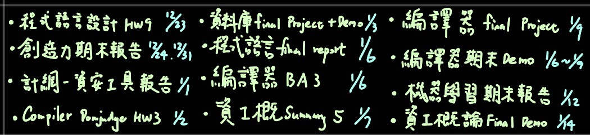

# 關於大三專題我學到的十件事
## 前言
大三下課程結束，也就意味著專題也告一段落，趁著還沒忘記這段寶貴的經驗之前，趕緊來回顧並總結自己這兩個學期學到的幾件事情。因為可以記錄的事情真的很多，所以這篇會比較著重在自己歸納出這兩個學期學習到的**經驗**，我會盡量不要提及太多技術相關的名詞，讓焦點專注在經驗上，希望這篇文章對未來閱讀的讀者(包括我自己)有實質的幫助。

至於整個專題使用到的技術以及遇到的困難，我會另外寫在其他篇文章上。

## 學到的寶貴經驗
下面就列舉**十個**我學習到的寶貴經驗，雖然我自認為混了兩個學期，不過仔細回想還是有學到不少內容。我打算把它寫下來，好說服自己多少還是有學到點東西。

### 1.做好充足的準備再下決定
當初大二下在找專題指導教授的時候沒有好好的評估與思考就直接決定要加入現在的實驗室，現在往回看總覺得沒有好好地評估過在下決定有點可惜。當時沒有認真思考實驗室方向與未來生涯的發展性，如果我可以回到過去，我一定會仔細的評估以下三點: **教授的專長&實驗室的技術方向、教授的指導態度、專題生的參與度**，而興趣應該要放在這三點之後。

以當時的眼界與知識廣度絕對無法讓我決定出當前最好的選擇，不過就我所知有參加專題說明會的教授中，這個教授以及他的實驗室所做的方向最接近我有興趣的開發，也就是**遊戲開發**。於是我就選擇加入了。

至於實驗室實際情況如何(笑)，我會另開一篇文章來寫，能談的東西實在太多了。

### 2.好的溝通幫你省時間
好的溝通真的很重要!這個觀念是我上半學期最大的感想。當初參與計畫端的會議時有一起討論，不過計畫端的要求一直不是很明確，有新增修改。除此之外，也許是計畫端那邊的教授很忙同時有很多個案子在跑，所以比較沒有特別關注我這邊開發的東西。最後的結果就是，跟計畫端那邊demo好幾周之後才發現**方向根本做錯**，浪費了好幾周。

其實上述問題的發生與計畫端也有一點關係，不過後來仔細想想如果自己夠積極主動是可以避免的，只能說自己還有很大的改進空間。詳細發生的問題會寫在另外一篇上。

### 3.提前計畫不會吃虧
大三上與大三下的所修的課程偏多，兩學期的課程都有到**21學分(含專題)**，相較於每學期的最低標準16學分來說應該算滿多的。剛開學的時候還算輕鬆，當期中考周或是期末考周來臨的時候，就會感到時間嚴重不夠用，各種報告&考試都集中在這一兩周內，壓力有夠大。

所以提前規劃好各種事情比較不會手忙腳亂。

### 4.有些事情不是你的錯，但卻是你的責任
剛加入實驗室的時候，原本要做的項目有學長的專案可以參考，但後來發現學長開發的專案所使用的**設備已經停產**了。而且更慘的是，深入研究學長的專題後發現，專案中的程式碼是來自設備商發佈在平台上的開發套件(姑且稱他為prefab吧)，總而言之就是一個可以直接拿來用的套件，前提是要使用他們家的產品。

當時我遇到的第一個大問題就是，我要拿著**新的設備來達到相近的功能，但我沒有可以參考的script**。而我遇到的第二個問題是，**實驗室沒有人做過類似的，連碩班學長都沒有**。

有一段時間真的有點崩潰，我想要達到的功能網路上相關的資料很少，應該說幾乎沒有。為什麼相關資料很少呢? 這就跟我想要達到的功能有關了。老師的要求是希望能用設備來控制遊玩，就像是學長專題做的東西。然而，實驗室所購買的這個設備是一個**完整的產品**，開發商販賣這個設備的目的是希望買家可以購買他們製作的遊戲，換句話說，是為了讓玩家體驗這款遊戲而販賣這個設備。**這個設備被販賣目的從一開始就不是為了開發**，自然而然在官網上就不會出現針對這個設備的開發文件、開發套件、或API可以讓我來研究使用。

這也間接導致我大三上學期整個進度大當機，只能先去做比較次要的開發，好讓每周的meeting內容看起來不會這麼水。不過最後還是躲不掉老師的提問，有好幾周都只能尷尬的回說，「這部分我還在努力研究中...」。

抱怨歸抱怨，不過這也是當時我自己需要克服的問題；我想說的是，**有些事情不是你的錯，但卻是你的責任。**

### 5.別跟自己過不去
除了上面提到問題，還有不少讓我灰心的各種事情，包括開發的項目與我當初加入實驗室前的期望不同、製作的遊戲很無聊、教授的態度等等。

導致我大三上有好一段時間心情很沮喪(尤其是期中周前後&期末事情一多的時候)，算是進入一個**低潮期**吧。那段時間常常出現自我懷疑，尤其在與同學聊天的過程中了解到同學們在專題上的所學與進度之後，我就會問自己:「你現在在幹嘛? 這真的是你希望的嗎? 你對現在的生活滿意嗎?」，而答案顯而易見: **我很不滿意** 。

後來我心念一轉，**很多事情不是我能控制的**，因此**只需要專注在我能努力的事情**就好，至於我無法改變的事情就隨他去吧。除此之外，在寒假休息期間我也鼓勵自己下個學期無論如何都要努力把這個這個功能給做出來，不然以後的我肯定會很後悔。

我必須說，壓力大的時候做點可以舒緩壓力的事情真的很重要! 無論是打球運動、看影片玩遊戲、聽音樂娛樂，或甚至找朋友聊聊都很有幫助。特別感謝與我同一個實驗室的專題生**小崴**時常在meeting完之後陪我吃飯聊天，雖然我們加入的計畫不同，但都有遇到各種鳥事XD，互相吐苦水大大的幫助我紓解壓力。所以壓力大的時候別跟自己過不去，撐到最後才是真的!

### 6.不要指望別人會對你有幫助

在前面提到的低潮期中，我甚至還一度萌生出擺爛的想法，總想著如果讓老師調人來支援我，或乾脆老師把我換到別的計畫底下去做那該有多好。但那也只是我在壓力大的時候所產生的想法罷了，最後也沒有如願發生。

後來我想通了一件事那就是，**「不要期待別人總會對你有幫助」**。每個人都有自己的事情要忙，而且實際上他們也沒有義務要幫忙，所以很多事情還是要靠自己來，俗話說的好:**「師父領進門，修行在個人。」** 

### 7.真的不行的時候還是要尋求幫助
雖然才說不要期待別人會對你有幫助，但這樣講並不代表你不能主動去尋求幫助。事實上，當一件事需要花費大量的時間跟力氣來做，卻仍然沒有什麼實質進展時，這時反而要**檢討自己是不是方法不正確**。當遇到困難時，比起自己埋頭苦幹，尋求他人的意見或幫助才是正確的。

在這邊也要特別感謝Yo學長的幫助，在我遇到困難的時候有丟一些網路的資料，或是提供我一些想法，甚至提供我對這方面有經驗的開發者的微信帳號讓我可以向他請教問題(雖然最後還是沒有幫助就是了XD)。另外也要特別感謝Yang學長的幫助，在我開發上遇到困難時，幫助我分析問題可能的原因。沒有這兩人的幫助，我沒有辦法順利的完成這個專題成果。

### 8.你認為很基本的事情在其他人眼中可能看起來很難
在上面提到的問題終於解決的時候，還記得有不只一個研究生跟我說你這個真的厲害，直接硬幹寫出來。但如果將我達到最終結果的步驟一一拆解，其實也沒有用到多艱深的技術，在查找資料的過程中，我也很幸運的找到某位大大在GitHub上開源的API，使用這個API我就可以在使用的軟體中獲取到藍芽設備傳送過來的data。最後經過一番臨摹參考別人的scipt才得以客製化一個能在專案中使用的script，其中也包括**轉換設備傳送來的原始數據**，這也是為什麼學長會覺得硬幹真的猛。但講真的，如果該設備一開始就有開發套件可以使用，那我也不需要為了這件事情焦頭爛額半個學期，我也可以花更多時間在改善其他部份上。

### 9.人都是自私的
在遇到困難的那幾周meeting時，我在報告的簡報中都會放上遇到的困難，希望讓老師了解我無法解決。我也在幫自己找理由，試圖製造出**我努力過了，但我就是無法**的假象，但當我後來發現老師根本不太在乎，也不想幫我的時候，我就改變主意了。

我不再提出我遇到的困難，變成單純的報告自己完成的進度。我甚至會在比較忙的時候把**已經完成的進度**分成兩周來報告，剛加入實驗室的熱情早已燃燒殆盡，只剩交差了事。個人心境的變化可以談的比較多，而這跟我們實驗室的專題性質有很大的關係，之後會在另一篇文章中分享，總而言之就是我最後也**逐漸走向偷懶的道路**。

**人都是自私的**，教授也是、學長也是，我也是。
### 10.一切都是最好的安排
現在這個時間點往回看這兩個學期的日子，雖然有非常多的事情可以吐槽，但我也學到非常多事。我認為自己的**軟實力&硬實力**都有所提升，提升的程度比起過去修過的任何一堂課程都來的有效果。這兩學期的經驗與過去的學習經驗不大相同，以往我都不太會認真思考並嘗試自己解決問題，遇到問題時通常都是先上網找解答，這個壞習慣也讓我嘗到苦頭。經過這兩學期，我深刻的瞭解到，自己應該要先專研過再去尋找答案，不然若網路上沒有直接的解決方法那豈不是就無解了嗎?

藉此機會我也了解到為什麼資工系的必修課程我都學不太好，這都是**不求甚解**的後果，畢竟很多時候作業網路上都有解答對吧? 關於這個問題我之後也會寫一篇文章來分享。

## 總結
以上就是我大三專題這兩個學期學到的十件事情，這是我第一次寫這麼長的回顧文，不過機會難得想說稍微記錄一下。這篇文章也會是我發佈在**個人網站**上的第一篇文章，有一句話是這麼說的，**「寫作，是最好的自我投資。」**，我很想看看這句話是不是真的，試想自己如果持續公開寫作1年、5年，甚至10年? 成果怎麼樣我不知道，但我會試試看。