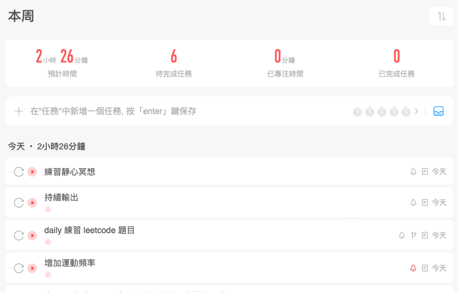
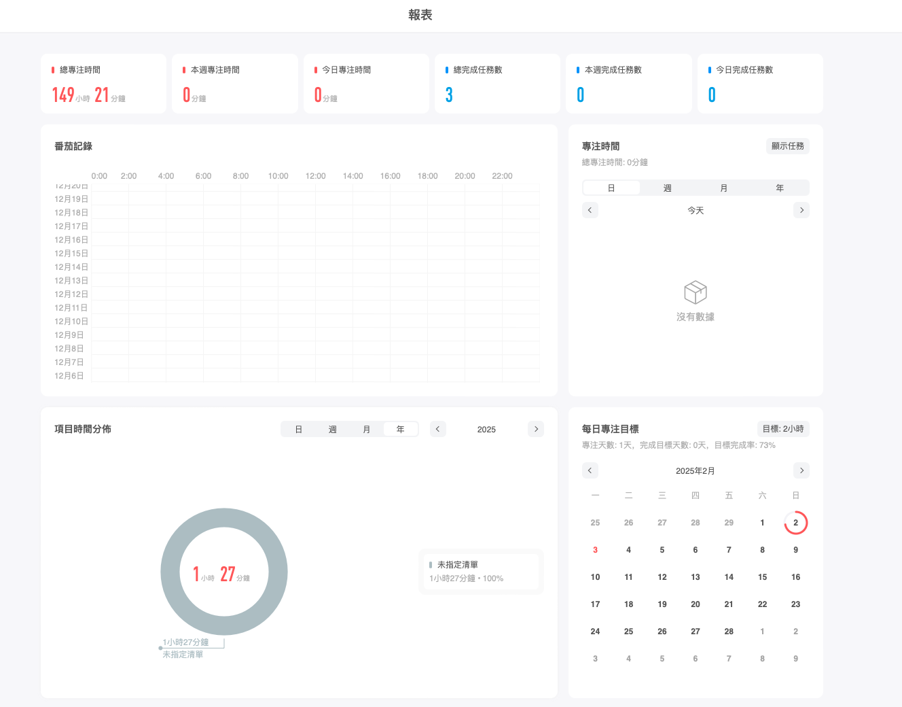

# 2024年尾六個月個人目標執行回顧

## 前言

今天是 2025/02/02, 星期日, 也是 2025 農曆新年九天連假的最後一天。還記得三個月前的這篇文章 [2024 年尾的 6 個月個人 & 職涯目標](./2024_6_month_goal.md) 嗎？原先的計劃是預計在文章發佈並執行後的首月會來檢視, 並寫在原篇文的後記中, 但因為不知名的原因, 最終沒有在首月寫下檢視文。

於是想著趁著正式開工之前, 剛好在整個 6 月目標的中間位置, 我們趕緊來回顧這段時間的執行狀況。

先說結論：**毫無意外, 不盡人意**

為何會說 毫無意外, 又說不盡人意 呢？ 這兩個看似互相矛盾的詞語又是怎麼一回呢？讓我們仔細的來復盤下。

## 半程執行回顧

> 以下的章節標題會根據不同問題分段落循序漸進, 在回答的同時, 也會一層層慢慢地理解執行的狀況

### 總共有哪些目標？
根據 [文章](./2024_6_month_goal.md) 中的提及, 一共可以分為兩大目標: **個人生活目標** & **職涯目標**, 而之下又分爲四個子目標。其中冒號之後的為最初的標準, 原本是用來嘗試看看行動目標

- 個人生活目標
	- 早睡早起, 規律作息: **每日最晚 00:30 前就寢, 早上最晚 8:00 起床**
	- 增加運動頻率: **一週運動三次, 每次超過 30 分鐘**
	- 降低無益的娛樂時間: **每週無益娛樂的總時間不超過 24 小時**
	- 練習靜心冥想: **每天至少練習 10 分鐘**
- 職涯目標
	- 修改履歷 & 履歷文字: **產出一份可以隨時投遞的簡歷**
	- 刷 leetcode 題目: **將 Neetcode 75 寫過一遍** (每週至少完成 3 題)
	- 學習測試理論 & 知識: **能夠針對測試理論寫一篇公開的介紹文章**
	- 持續輸出: **每週至少寫一篇 blog 文章**

### 目標執行的狀況？
總體來說, 執行的不是很好, 只有不到一半的行動目標有達到預期, 總體生活不會說到有太大的變化。

### 自認成功達成的部分？

目前看下來有成功達成的部分目標為：*刷 leetcode 題目*, 在最初的標準中, 我希望自己能每週至少完成 3 題 Neetcode 75 （也就是 Blind 75） 的題目。

撇除這兩週遇到年假休息之外, 在這之前**連續 11 周**達到設定的標準, 並且也一同完成*持續輸出*的目標, 將每週完成的三個題目以分享解答的方式寫成簡單的文章, 每週持續發佈在個人 blog 中。

> 延伸閱讀：[Leetcode weekly practice](./leetcode_weekly_practice/leetcode_weekly_practice_challenge.md)

回過頭來, 已經做了不下 40 多題 leetcode 了, 雖然當中也有不少是過去曾經寫過的經典題目, 但是這過程中我仍然學到很多。雖然是由儉入奢, 但是能連續 11 周達成兩個行動目標對我個人來說仍是很大的鼓勵鼓勵, 增加我不少的信心。 

想了解更多關於寫過題目的資訊, 可以在這個 [公開 repo](https://github.com/VictorChao996/leetcode/tree/main) 中持續追蹤解題狀況。

除了上面兩個目標, *修改履歷 & 履歷文字* 也意外的有些進展, 因為一些意料之外的原因, 算是有達成:  **產出一份可以隨時投遞的簡歷** 的最初標準, 先挖個坑,找個時間再來分享這個意料之外的驚喜。
### 自認未完成的目標有哪些？

這部分就很多了,  直接用條列的比較快 :D
- 早睡早起, 規律作息：
	- 沒有實際統計, 但體感上跟過去生活模式差不多, 超出規定時間的次數為多數 (畢竟沒什麼強烈的變化)
- 增加運動頻率
	- 持續有在進行長跑, 每次至少有 3k, 加上走路緩和, 總時間一定超過 30  分鐘
	- 沒有實際統計, 但體感上絕對沒有每週 3 次運動, 每次至少 30 分 （若扣除通勤的話）
- 減少無益娛樂時間
	- 沒有實際統計, 但體感上跟過去的生活一樣, 所以肯定沒有達成每週小於 24 小時的目標
- 練習冥想
	- 完全沒有實行, 連一次都沒有, ~~非常慘~~
- 學習測試理論 & 知識
	- 印象中也沒有做任何與這個目標相關的行動
	- 行動不夠明確, 無法將最初的目標 **”能夠針對測試理論寫一篇公開的介紹文章“**, 拆成可執行的行動

### 執行不如預期的原因？
我想執行不如預期的原因應該非常的明顯, 從上一段各個失敗的目標回顧當中可以總結出以下幾點：

1. **沒有設定具體可執行的微小行動**
2. **沒有實際統計, 無法量化執行的狀態 & 結果**
3. **沒有順利的將可執行的行動融入到生活習慣中**

其實執行的結果在在 [原篇](./2024_6_month_goal.md) 便可略知一二, 根據**設定目標的七個公式**, 要完成一個目標最好滿足以下七點：

- 設定目標
- 訂出期限
- 製作目標清單
- 擬定行動的步驟
- 去除障礙因素
- 立即實踐
- 持續前進

很明顯的, 失敗的原因在於沒有規劃好行動的步驟, 並排除此障礙。行動困難對每次執行來說都是一個阻力, 無法立即實踐, 久而久之, 大腦便會自動放棄。 

### 後續改進調整的想法？

針對以上不如預期的分析, 我認為需要做以下的調整：

1. 量化目標的行動
2. 不同執行目標不一定要掛鈎再一起
3. 每週要持續回顧行動 & 目標
4. 紀錄並觀察自己的生活
5. 將可執行的微小行動融入到日常生活中

首先, 要量化行動目標並開始記錄, 如：運動, 睡眠, 冥想, 減少娛樂時間的等目標。工欲善其事, 必先利其器, 這邊需要一個能夠幫助統計時間的工具, 剛好以前有買過一個叫做[專注清單](https://play.google.com/store/apps/details?id=com.superelement.pomodoro&hl=zh_TW&pli=1) 的 app, 一款可以自訂目標並以番茄鐘概念下去設計, 旨在協助使用者專注的一款 app。除了可以充當鬧鐘的功能, 他最大的好處**統計報表 & 跨平台使用**對我來說的非常有用。

> 將每天要做的事情紀錄在 app 中, 並在使用番茄鐘的功能協助專注。

> app 也會有簡單的報表

再來, 不同目標之間的行動不用綁定再一起。以這次較成功的目標為例,  原先 leetcode 目標希望能每個星期至少能寫三題, 為了順便完成持續輸出的目標, 就在 blog 上開了 leetcode 系列挑戰文。一開始的確執行的不錯, 每週都有寫三題, 並且也有發佈挑戰文到 blog 上, 但漸漸的我感覺到不太對, 變得每週一開始只選定三題要發布文章的題目下去練習, 有點反客為主。

原本的行動的本意為多練習 leetcode 題目, 並且若有額外的心力再發布文章, 沒想到執行多次後, 反倒變得有點像是為了發布文章而寫題目．．． 

我想本質上其實還是目標的行動不夠清楚明瞭才會把兩者綑綁再一起, 尤其持續輸出的目標並沒有限制是哪方面的文章, 讀書心得, 雜談都可。目前規劃為不再要求 leetcode 挑戰文章要每週發布一次, 預計接下來的三個月還是先以練習題目為主。但還是會不定期更新文章, 因為我發現寫文章過程有助於理解解題的思路。

最後, 定時觀察並回顧目標執行的狀況, 並持續將合理可執行的微小行動融入到日常生活中也是很重要的一環。現在想想, 失敗最主要的原因除了**沒有量化行動**外, **沒有定期回顧**也是一大原因。老實說, 沒有一個好的系統來降低執行的阻力, 需要回顧的時又無所適從, 惡性循環, 時間一久, 失敗是必然的。人都是好逸惡勞的, 當執行的阻力大過其他娛樂活動, 自然會選擇後者。所以目前下一步會是先觀察統計自己這一兩週的生活習慣, 減少想要替換的習慣, 並安插行動的目標到原先的時間段中。**希望動用習慣的力量, 讓這些微小的行動變得輕而易舉**。

> 「 造就成功的, 是日常習慣, 而不是千載萬逢的轉變。1%的進步,連續堅持造就成功的習慣 」- 【原子習慣】

## 結語
雖然整個計畫期間已經過半, 但我想重新來過絕對不嫌晚, 希望這次能記取教訓, 順利達成目標, 我們三個月後再來總結。

