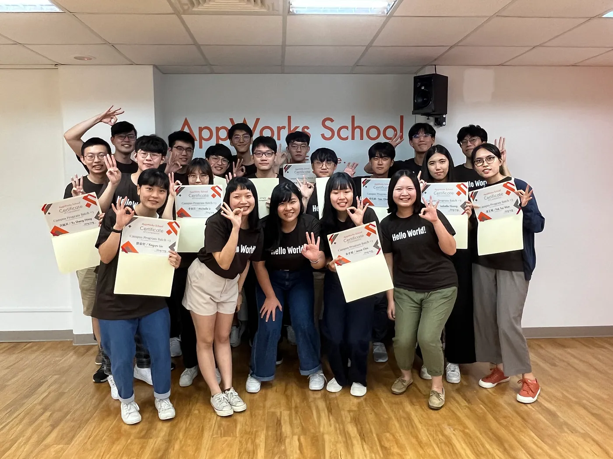
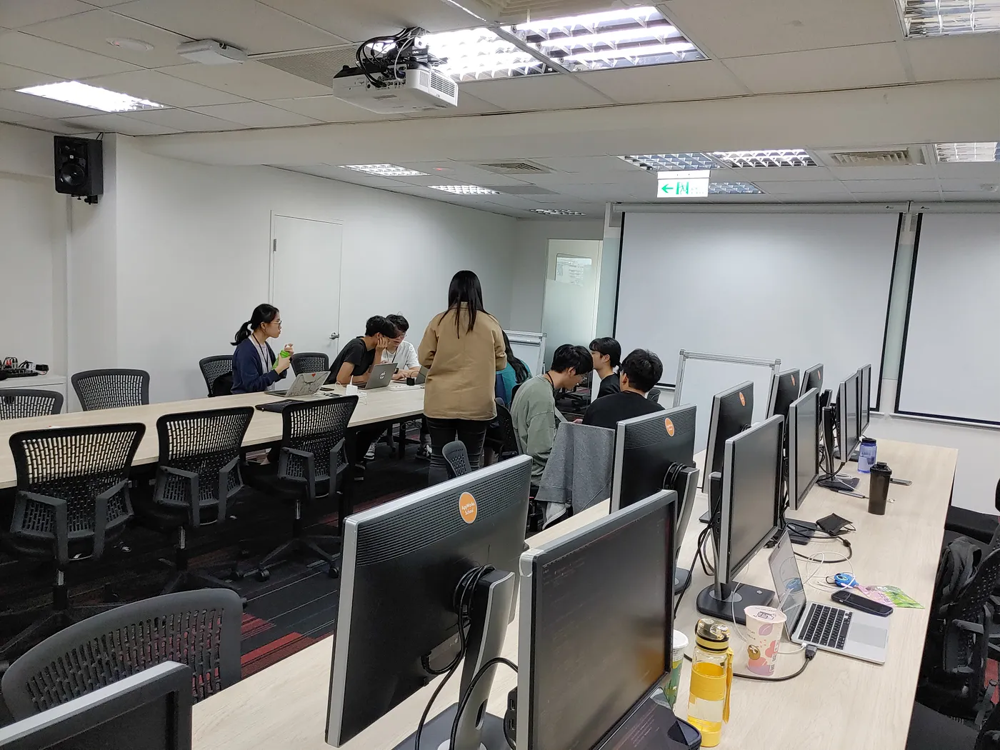
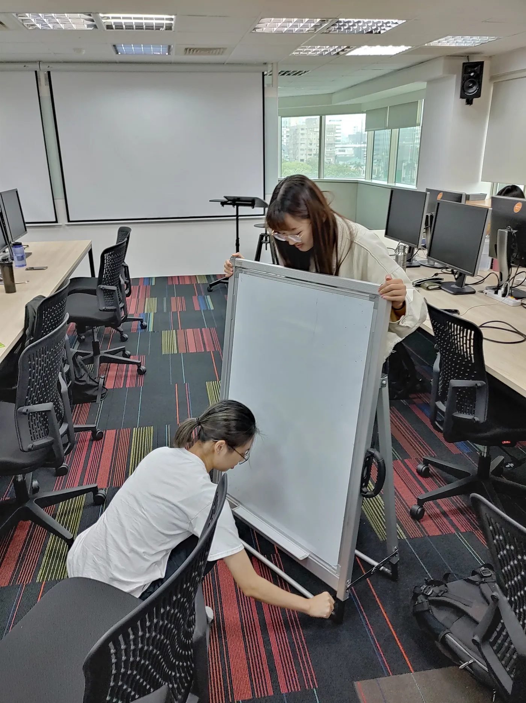
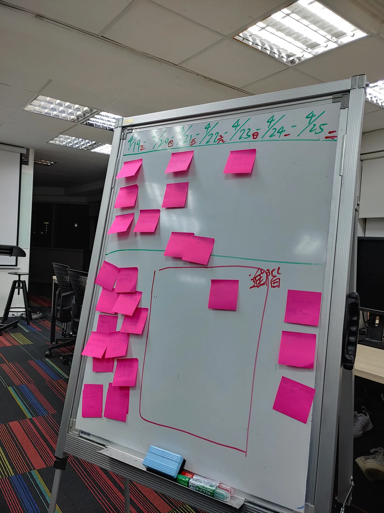
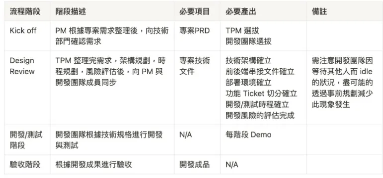
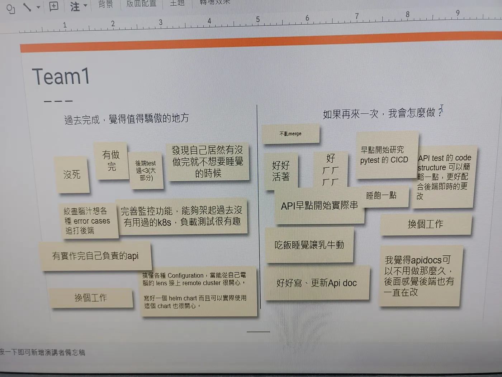
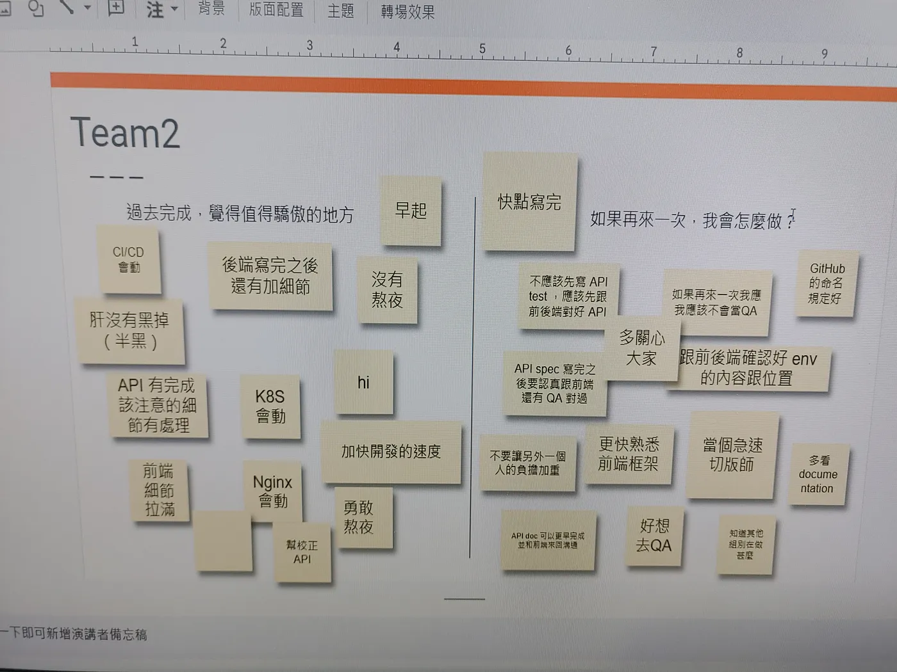
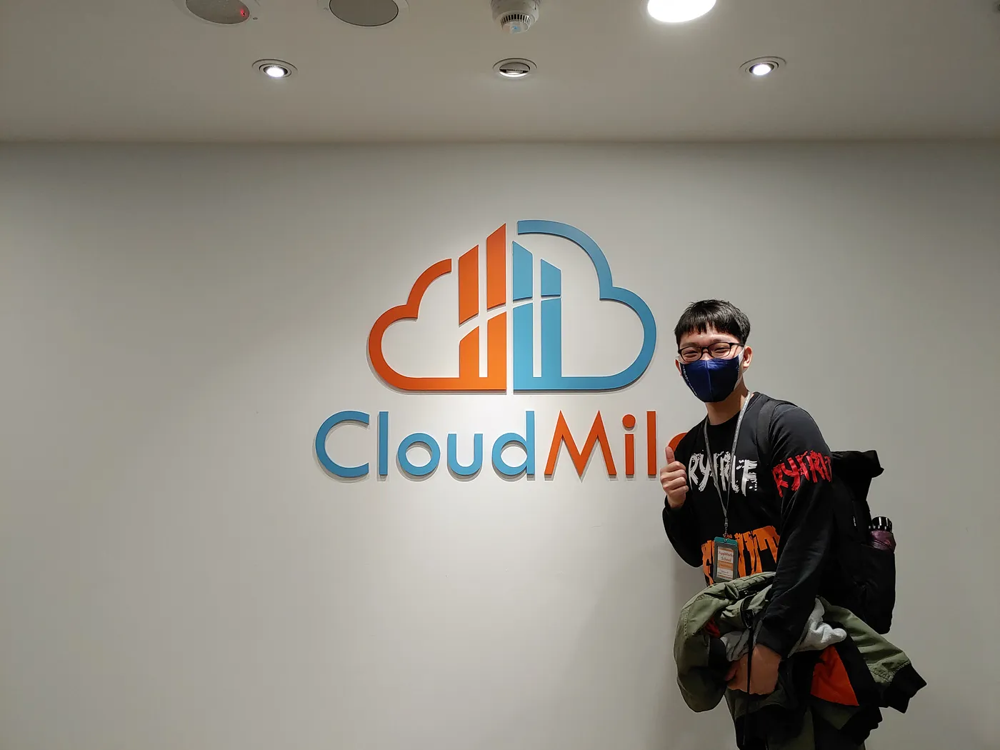

# AppWorks School Campus Program #3 結業心得

大家好，我是 AppWorks School Campus Program #3 的學員 Victor , 畢業於國立中央大學資訊工程學系，職涯初期希望朝 QA Engineer 或 後端的方向努力，目前在等當兵中😅。很榮幸能在這邊與各位讀者分享我在 AppWorks School(以下簡稱 School) 的所學與一些小小的心得。

這篇文章主要分享我個人的一些所見所得，關於 AppWorks School 的簡介就不多提，重點主要會放在自身的經驗上，希望對有興趣報名 Campus Program #4 的同學們有一點幫助。

以下是整篇心得文的大鋼，趕時間的讀者們可以挑自己想看的內容進行閱讀:

- 報名動機
- 報名 & 面談準備
- School 的學習資源
- School 的學習過程
- 在大學學習與 School 學習的差異
- 感想&總結

## 報名動機
時間點是在大四上學期，那時正好處在一個低潮，平時成績太差，連自己學校的推甄都備取不上😢，那時也不打算繼續考研究所。就在我無比焦慮的情況下，AppWorks School 的廣告突然出現在我的視野中 (忘記是臉書廣告還是 Podcast 了)，在因緣巧合之下就報名了。

## 報名&面談準備
我覺得這個階段不外乎就是以下幾個重點。

### 1. 展現你的熱忱(動機)
首先最重要的是向 School 這邊展示你的動機，具體要怎麼做有很多種方式。最簡單&基本的方式大概就是好好的填申請表單，申請表單上有滿多個人引導式的問題值得你去發揮。一般人可能就隨便填一填，讀者可利用這些問題好好的說明你為何會想要了解軟體產業。你對於自己的想法&行動愈明確，你愈有機會被錄取。

### 2. 證明你的努力
除了展現熱忱外，第二點也頗為重要，你要證明你的熱忱不是空穴來風。可以在報名表單上說明你參與的課外活動，例如: 社團、實習、競賽或跟參展等，這些實際行動絕對比”我對軟體開發有興趣”這幾個字還來的有力。

除了文字說明以外，表單上也要求報名的人附上其他的連結，如: 公開履歷、GitHub帳號、自我介紹影片等都是能好好善加利用的。

### 3. 你不需要名校出生，你不需要是個強者
有許多人可能會認為說自己是不是要非常厲害才能報名，但其實不需要。老實說在報名的當下我對前後端一點概念都沒有，也沒用 HTML CSS JS 寫過網站，完全就是一個新手小白。我覺得只要對程式開發有一點概念，並且有足夠的動機&意願每周投入 30~40 小時的時間，錄取的機會還是很大的。

若讀者本身不是資訊相關科系也不用感到灰心，你比本科系的人有更多的故事可以說，例: 為什麼要輔系? 你怎麼接觸到寫程式的? 為什麼對軟體開發有興趣? 好好利用你自己的不平等優勢，來說一個好的故事吧!

最後再說說關於名校迷思，你不需要是個頂大才有資格，無論你是國立大學、私立大學、科技大學都能報名。還是一樣的話，做足上面兩點，你比任何人都有優勢。這邊要跟各位想報名的讀者說，因為 Campus Program 是免費的，所以 School 會盡量選擇能幫助到的學員，確保資源能被有效的利用。

> (強烈建議要參加前好好評估自身的負荷量，包含學期間的修課、外務等，才不會浪費這麼優秀的資源喔~)

## School 的學習資源
在進到下一個 part 講學習過程之前先給各位讀者介紹 School 這邊能提供給 Campus Program 學員的資源，我們這一屆的配置(台北班)如下。

- 舒適的學習環境: 27吋螢幕(外接) + 電腦椅
- 具有實務經驗的導師 * 3
- 認真負責的校務夥伴 * 2
- 與你一同奮鬥的學員們 * N
- 各式工作坊 & 企業訪談等活動

Campus Program 學員的位置會在8樓大空間，旁邊就是 School 校務的工作空間，不時會聽到他們的閒聊&笑聲，整體氛圍還滿歡樂的。校務也有跟我們透露，比起8樓歡樂的氣氛，轉職班待的9樓相對嚴肅很多(畢竟每天壓力很大而且沒有退路)。另外，如果你是需要專注寫code的人，我會建議坐靠近投影幕並且面向窗戶的位置，因為空間配置的關係，時常會有校務人員走來走去(旁邊剛好就是小間的會議室)，背對可能會稍微好一點 XD。

*Cmpaus 學員所在的共同空間(8樓)*

## School 學習過程
學習過程總共16周，採用的是翻轉式教學，並分為好幾個階段。不過每一屆學程都會稍作調整，在這邊以我的視角分享 Campus Program #3 的學習內容。

### 1. 遠距學習階段(3周)
遠距學習的3周主要是讓學員們使用[Learn to Code Online | Treehouse (teamtreehouse.com)](https://teamtreehouse.com/) 自學一些關於前後端的基礎，這個網站是訂閱制，付費之後就可以觀看所有的教學內容。School 這邊會推薦一系列跟前後端相關的影片讓學員們學習。除了學習外，每周都會有指定的作業，作業內容包含設置好 AWS 相關服務 & JS 的練習。當時的我沒有碰過雲端服務，所以在設置上花了不少時間。這三周大致上的實作練習有。

- 設置 AWS 相關服務 (EC2、RDS)
- 創建 GitHub Repo、建立 branch、發PR
- 使用 Express.js 建立後端服務
- 使用 React.js 建立前端服務
- 將前後端服務部屬到 EC2 上
- 使用 Nginx 整合前後端服務

在這個階段中除了 Git 的使用外，幾乎所有的學習項目我都沒有碰過，所以每天都花了大量的時間學習&研究這些 “新技術”。另外，在這個階段 School 有著淘汰的機制，做不出來的學員會被請回家。事後回想這機制也挺合理的，如果連 AWS 都設置不起來，後面每個階段都沒辦法做下去。

> 這個階段最後的成品: 一個可以登入的簡單網站

### 2. 個人指定練習專案(5.5周)
前3周”暖身”結束，開始要來點真的。在這個階段，學員會被要求實作一個名為 STYLiSH 的電商網站，導師會提供每周必須要完成的進度，前3周為後端，後2.5周為前端。每周進度中會提供的內容為當周要完成的 功能說明 & API SPEC。當學員依據要求完成當周的進度之後會在 GitHub 上發 PR，導師會上去 code review。另外，從這個階段開始，學員會被要求駐點(共同時段要出現)，而共同時段會由導師帶領大家進行每周的 recap(回顧)，讓學員們可以互相分享學習的內容。
這個階段主要的學習&實作內容:

git flow
建立 DB & DB table
SQL 語法 & 資料庫正規化
開後端 API & 寫 API doc(swagger)
登入登出(JWT token)、串金流
CICD (docker、GitHub Actions)
React 前端頁面 (SPA、RWD)
完成這個階段後學員們會對前後端有更進一步的認識，除此之外，還會接觸許多”寫程式”以外的事情。(CICD、撰寫 API doc & 使用 API 測試工具、發PR等)

### 3. Extend Project Co-work 黑客松(1.5周)
在這個階段中，School 會將學員們分成好幾組，每組3~4人進行活動。活動內容為: 由導師提供的 STYLISH 的 sample 專案下去做新功能的開發。導師會提供一個新功能表單，其中功能分為 簡單、中等、困難 三種，並且要求每種難度中至少挑一個功能來實現。第一周結束後要小組功能說明，第二周要上台 DEMO。

在這個階段有挑戰的地方有幾項:

與不熟悉的學員合作(School 這邊會刻意拆散)
要看懂 sample code (前端那邊的撰寫邏輯差滿多的)
選擇適當的功能下去開發 (挑有把握的，時間不太夠)
如何團隊協作 (專案進度掌控、code 規範 全部都自己來)
我們這組選擇實作的功能為: Excel 批次上傳商品資訊(簡易)、Line 商品上架通知(中等)、使用 websocket 實作線上客服(困難)。其他組別也做了一些有趣的額外功能，例如: 爬蟲做商品比價、限時動態、加密貨幣付款等等。我覺得這兩周滿有趣的，可以看到許多大神大顯神功 XD。

在這邊特別感謝我的兩個神隊友: Erin & Michelle，兼顧學業外還抽出許多時間弄黑客松的開發(聽說熬夜到5點?)，辛苦兩位了。

*當時的兩位神隊友: Erin & Michelle*

*讓頭腦風暴一下*

### 4. Practical Exercises 實務練習(2周)
在這個階段中，學員會被分為兩組開發團隊，並分為四種不同的職位(角色)，並根據PM事先準備好的專案PRD(Product Requirement Document 產品需求規格書 )下去做開發。

開發過程&理想的最終結果
以下是導師規劃的流程階段，大致上會經過以下四種階段: kick off, design review, 開發/測試階段, 驗收階段。
更多細節可以參考下方這張圖:

*模擬業界開發流程*

其中開發團隊內被分為四種職位，下方是各個角色與其對應的職責:

- Frontend(2位): 完成頁面開發並挑戰複雜的體驗效果
- Backend(3位): 完成 API 相關開發並設法增進效能
- QA/SDET(2位): 能規劃與透過嚴謹的測試讓開發團隊正確地交付需求
- SRE(2位): 能確保服務正常運行，並再出問題時第一時間感知

理想上的成果為以下幾個:

- 完成兩個服務(前台抽獎頁面、後台活動系統頁面)
- 一份對應需求的技術文件
- 建構 SIT 與 STAGE 環境
- 自動化測試流程 & CICD 部屬
- 實時監控系統與 Discord 告警機制

實際上的結果
理想很豐滿，現實很骨感這句話可不是說說而已，要學員們在兩周內完美的照著上面的流程走幾乎不可能。我整理幾個我認為我們這組最後失敗(或者說沒有按時間完成要求)的原因:

對該職位的職責&技術不熟悉(尤其 QA/SDET & SRE)
開會時間喬不容、會議沒效率
大家不清楚自身職位以外的開發進度&職責
團隊士氣低弱
其實在這個階段下不少學員壓力都很大，尤其身兼學業或其他外務的人會很明顯的忙不過來。再加上當時跟我同為 QA 的學員離開了，事情突然增加，導致我心態有點小崩。偏偏跟我一組的都是大忙人，團隊亂成一鍋粥的情況下，就會產生我是誰? 我在哪? 我現在在幹嘛? 的錯覺。

自我檢討
我選擇的角色是 QA/SDET ，這個角色的職責大概有以下幾點:

- 承擔因服務開發上的 BUG 造成實際業務損失責任
- 在 SIT 環境建構 後端自動化測試 並在後端 CICD 部屬後接續執行
- 使用 K6 在 STAGE 環境建構 抽獎流程相關 API 自動化負載測試並定義 RPS 通過標準
我認為我在這個階段中最可惜的一件事情就是沒有盡到 QA(Quality Assurance)的職責。**軟體品質的價值不僅僅是只能建立在測試的工作上，有經驗的 QA 能在開發階段的早期，也就是 design review 的時候就指出可能會有問題的地方**。

我舉個例子，當團隊內的技術文件出來的時，我有適當的指出 API response data 的缺漏。而在 response data 沒問題的情況下我就去撰寫本地的 API test 了，而我犯的最大的錯誤就是沒有真正的釐清開發需求，不了解為何會開出這樣的 API 。於是乎結果就是直到 DEMO 前的最後幾個小時後端 API 都還在更改，後端也很誠實地跟我表示他們沒 run 本地 API test 就發PR了。(那我在幹嘛?) 我甚至聽到組內前端對後端說: “ㄟ為什麼 API是這樣開?” 😂😂😂，總之就是相當壯烈就是了。

至於 SDET 的部分，我應該早點嘗試後端自動化測試這件事。對 GitHub Actions 不是特別孰悉，再加上這些環境是需要藉由 VPN 才能連上，最終沒有成功把自動化的流程建立起來。而負載測試的部分則是 SRE 那邊 Grafana dashboard 尚未建立起來，所以寫好的 K6 程式也只能躺在那邊。

API test 可以參考這個 repo : https://github.com/VictorChao996/SIT-API-test
K6 負載測試 : https://github.com/VictorChao996/K6-load-testing
在這個階段中我最大的收穫就是團隊開發上遇到的困難帶給我的震撼，團隊沒有好的開發規範&磨合的話在開發上會異常的困難，也會間接導致其他的負面效果。如何的確保團隊正常的運作下去真的是高深的學問，經過此次學習，我終於明白為何公司會如此強調企業文化，好的開發團隊也注重建立團隊的氣氛&正確的開發文化。

*活動結束後的反思(team 1)*

*活動結束後的反思(team 2)*

5. Personal Project 個人專案(3+1周)
到了這邊就是最後一個階段喇，School 會帶著各位學員進行個人專案的發想。而這幾周也有各自的驗收(personal project proposal、Sprint 1~3)，題目不限，想做什麼都可以。不過導師這邊會提供各種意見(施壓)，並追蹤學員們的開發狀況，確保最終成品具備一個完整度。(至少不要有作業感)

在這個階段壓力稍微比較小一點，因為可以照著自己的步調下去開發，合理的安排自己的時間。我覺得這幾周主要的學習重點為:

資料收集
時程規劃
上台 DEMO 的能力
導師&校務們也不斷的強調說，在 DEMO時候可以把大家當網站的使用者一樣帶著大家一步步的使用自己的網站。但要在短短的3分鐘內做好這件事真的不太容易。

現在回想當時 sprint 2 時的 DEMO 就各種尷尬，上台前沒有準備的後果就是講得很爛，台下的學員也是一臉: 蛤? 這就結束了的表情?

我最後做的成品是一個可以使用 markdown語法 撰寫履歷的網站 [VictorChao996/markdown_resume_maker: Appworks School Personal Project : Markup And Down (github.com)](https://github.com/VictorChao996/markdown_resume_maker) ，老實說可以改善的點不少，例如: 前端網頁效能、自訂模板、RWD等，但至少以一個開發3周的作品來說還算完整? 感興趣的讀者可以上去玩玩看。其他學員也做很多滿有趣的作品，例: leetcode刷題群組、宅宅追星網站(爬蟲彙整偶像的資料)、Lensfinder(相片膠段分析&鏡頭推薦網)等。

## 大學學習與 School 學習的差異
以下列出幾點我覺得跟大學學習很不相同的地方，以及為何你應該要選擇 School。

### 翻轉式教學
兩者最大的不同為 School 這邊採用翻轉式教學，在這邊不會有老師在講台上授課，課堂主要的目的是討論與參與，而學員就根據導師的要求進行實作&練習。 那可能這時有人會有許多疑問: 這樣學習效果好嗎? 難道翻轉式教學不會翻車嗎? 我大學的課堂有搞過翻轉式教學，但效果很差，你們這邊不會有這樣的問題嗎?

如果讀者有過翻車的經驗，那我可以保證 School 不會出現類似的情況，因為這邊有學校沒有的(或至少我的學校沒有的😂)兩個重要因素。

### 具有實務經驗的導師
有實務開發經驗的導師真的很重要，台灣的教授們，尤其是公立學校，大部分都是博士班畢業後就直接朝著教授的路發展。在這幾十年中都在做研究，理論方面他可能很熟悉，但是沒有任何實務開發的經驗，所以開的課程只能偏理論方面的。教授們不了解實務開發上會遇到的問題，或者說沒有”親身體驗”過職場上會遇到的種種狀況，也就沒辦法設計出好的翻轉式教學。

School 這邊不同，導師都是具有業界經驗的(甚至有的還在職)，對於菜鳥會遇到的問題多少心裡有數，因為導師們也當過新人，踩過的坑比學員們多的多。另外一點很不同的是，在 School 如果課外有遇到任何問題隨時都可以詢問導師，例: 職涯規劃、職場八卦、履歷健檢等，導師們都很樂於為學員們解答；反觀學校教授，課堂以外的時間基本上見不到 XD。

### 認真的同學們
翻轉式教學不乏會將同學們分成小組進行團體活動，相信大多數人都遇過小組成員會擺爛的鳥事，我們對於這樣的人無能為力，畢竟這對他們來說這只是眾多課程中的一門。然而在 School 比較不會有這樣的問題，參加 Campus Program 的學員都是有一定的動機跟對未來的嚮往才會來報名學程，經過 School 篩選後留下來的學員都是足夠優秀的同學(或至少心態上正確)。

如果要比喻那種感覺的話有點像是學習型社團，只不過強度大概是 5 倍以上。

## 感想&總結
### 可惜的地方
我覺得整個學習過程比較可惜的地方是活動安排的比較緊湊，有種上個階段還沒有忙完又要趕著前往下一個階段的感覺，如果時程的稍為寬鬆(或至少不要重疊)學員的壓力會比較小。另外還有一點比較可惜的是，因為是學期班的關係，只能在共同時段見到大家，在有團隊合作的階段還是大家面對面討論效果會更佳。

### 學習與成長
在 School 學習過程中真的很紮實(沒在騙XD)，直接用最粗暴的方法把我從生活中的低潮給拉出來(事情都做不完了，哪有時間 emo)。雖然每一週都很辛苦，壓力頗大，不過我也在實作的過程中獲得不少成就感，現在往回看真的覺得當初有報名真的是太好了。我得到很多系上不會接觸到的學習經驗，讓我能在進入職場前，一窺軟體工程師的日常。

*企業參訪活動(CloudMile 萬里雲)*

### 最後
這麼難得的機會還等什麼 ! 還不趕快手刀報名 ! 點擊下方傳送門去逛逛~

> 活動報名連結: Campus Program Batch #4 | AppWorks School

希望讀完這篇文章的讀者能對 Campus Program #4 有興趣，如果有任何問題，歡迎透過任何方式聯絡我，時間允許的話我都會盡快回覆。

Email: 96094victor@gmail.com

LinkedIn: [Victor Chao | LinkedIn](https://www.linkedin.com/in/victorchao996/)

### 致謝
感謝辛苦的導師(Frank、Addie、John)要帶我們這群連 junior 工程師都不是的學員，時常看到導師半夜2.3點在發公告，還要 review 我們發的 PR，關心學員的學習狀況等。

特別感謝導師 Frank 在實務練習階段心態比較崩得時候給我的鼓勵，並告訴我說其實在開發團隊建立初期特別容易遇到磨合的問題，**吵架不合推卸責任、文件沒有歸納到處亂飛、沒人會做乾脆不做等問題比比皆是**。身為其中一個角色能做的也只有盡力主動跨領域協調，用自己的方式設法讓整體開發能順利進行。無論公司大小都會遇到類似的問題，能在現在這個階段就接觸並體驗倒是滿難得的。總之特別感謝 Frank 抽空關心我，你的鼓勵對我有很大的幫助!

特別感謝 Addie 幫我從指令歷史紀錄中找回設置環境變數的方法，在STYLiSH階段無意間把環境變數給抹掉，導致連 `ls -al` 指令都用不了，差點就要把 EC2 instance 給砍掉重來了。

感謝其他校務夥伴(Carolyn、Luna、Tiffany)幫忙安排各種活動(各式工作坊、修改履歷、企業參訪等)，還要順道關心各位學完的身心健康，你們是最堅強的後盾。

感謝其他 Campus Program #3 的學員，讓我暫時脫離邊緣人的生活，與你們互動真的很有趣! 在成長的路上有一群夥伴真的很難得，很高興大家完成了這段旅程，相信以後都能在軟體業看到各位的身影👍。

最後特別感謝 AppWorks School ，謝謝你們給我這個機會讓我可以接觸到這麼多有趣的事情，學習到一點點的技術，認識了一群可愛的人。我很珍惜這次的相遇，特別感謝 🥰。