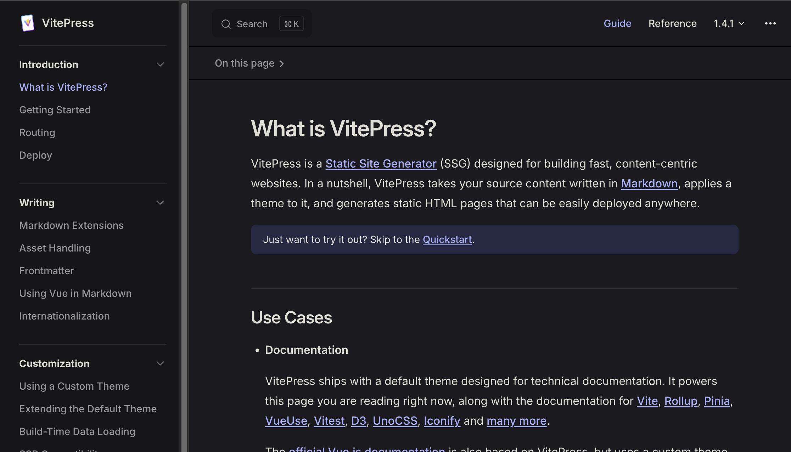

# Blog 搬家了
## 起因

在 2024 年 10 月中產生對自己的職涯＆個人目標的一些想法, 於是便寫下了這篇文章 [2024 年尾的 6 個月個人 & 職涯目標](../2024_6_month_goal.md), 其中的一個職涯目標為： **持續輸出**。

關於持續輸出, 其實這是一直以來都有目標, 可以從這篇 1 年多前的文章 [2022 年度回顧 ＆ 2023 年目標](../2022_review_and_2023_goal.md) 略知一二。當時心血來潮用 [Hugo](https://gohugo.io/) 架設靜態個人 blog, 也有零星寫過幾篇文章, 但後續一忙起來, 就把這件事情拋在腦後了。

一直直到現在我才發現, 發現自己有好長一段時間沒有寫 blog 文章了, 最後一次寫 blog 文章還是大學畢業前的事情, 於是開始把過去架設的個人 blog 專案拿起來研究研究。

## 對於個人 blog 的要求
以下是幾點我對於個人 blog 的想法, 可以從中一窺我在工具上選擇與使用的邏輯
1. **方便編輯**:  最好能以 markdown file 撰寫文章內容, 方便備份 & 還原 content
2. **網站管理 & 控制**: 除了內容文字在自己手中外, 希望網站是可控的
3. **公開瀏覽**: 任何人都可以透過 url 放問這個個人 blog
4. **簡單啟動**: 不用裝一堆插件或設置資料庫等

以上幾點說明我為何不用一般的內容發佈平台如: Medium, 方格子Vocus 等,雖然簡單好用, 但因為文章都在平台上, 若哪天平台倒了就沒了, 所以第 2 點尤其重要。第 1 點也是我特別注意的點, 寫文章重點還是在內容, 不用搞一些花裡胡哨的 text style, 所以 word 型編輯器也不吸引我, 能用 markdown 為佳。

## 重新開始

### 網站掛了？
因為實在太久沒有維護專案, 以至於網站何時掛掉我都不太清楚, 也懶的 debug 重啟了, 所幸過去寫的文章內容有部分備份, 於是乾脆從新用 Hugo 建立一個專案。

### 搗鼓 Hugo
原以為有架設經驗應該會滿順利的, 但不知為何自己滿意的 theme 無法像過去一樣成功裝起, 即便我照著官網的步驟也是。

後來想了想, 就算將 theme 裝起來後, 還需要去寫相應的 config.yml 檔, 而且每個 theme 都有自己獨特的功能 , 甚是功能多到需要寫個 document。對只是想要有個可以掌控內容的 blog 來說, 這些都不是最重要的.....

思來想去, 最終還是放棄 Hugo。

### 新的工具
在這段研究的時間點前後, 偶然間發現另一個 SSG (Static Site Generator) 工具叫做 [vitepress](https://vitepress.dev/), 與 Hugo 類似, 都是可以根據 .md file 內容產生網站的工具。不過 vitepress 主要是用做專案 repo 中維護 document 的部分, 所以 theme 風格特別像是技術 document （如下圖）

> vitepress 官方 document screenshot

在看到這個工具後, 我新建的[個人 document](https://victorchao996.github.io/docs2/) 就從舊的工具轉換到 vitepress, 除了專案檔案結構單純, 也有一點特別吸引我, 那就是內建 document 的必備功能: **TOC (table of content)** ＆ **全域文字搜索**。若有時間會再分享我如何搭建個人技術文件, 寫成一篇文章。

好回到話題, 在個人 doc 架設起來後, 就想說既然 doc 是用 vitepress 架設, 那乾脆 blog 也使用吧, 專案結構類似的話也比較好管理, 減少 content switch 的時間。

於是就有了現在的網站。

### 新的挑戰
但隨之而來又是新的挑戰, 為了 document 而生的 vitepress, 可不會內建適用於公開 blog 的功能。如：

1. blog 首頁: 通常會有一個以時間排序的文章列表頁面, 其中每個項目都包含文章標題 & 簡易內文讓讀者可以快速預覽近期發佈的 blog 文章
   - 當前 vitepress 上所有的 link (包括 Navbar, Sidebar 等) 都是必須要在 .md 上註明的, 不會自動產生
2. 自定義文章分類頁面: 例如透過 tag 分類並顯示文章的頁面
3. 其他進階功能: 社群分享連結, 評論區, 更新熱圖, 電子報功能等等

好在 vitepress 這個工具是**基於 vite & vue 開發的**, 在 theme 中除了可以自定義 CSS 外, 也能夠**註冊並使用自己建立的 Vue component**, 提供一定程度的自由度。

不過個人目前還是希望能專注在產出文章上, 先把寫作習慣建立起來, 有時間再來寫寫能夠擴充此 blog 的工具。

## 結果
經過一番研究與嘗試, 這個 blog 終於架設起來了, 目前公開訪問 url 為: https://victorchao996.github.io/blog/ , 與跟 doc 差在 io 後面的路徑從 /docs2 換成 /blog。 雖然現在還很簡陋, 不過只要符合 [2024 年尾的 6 個月個人 & 職涯目標](../2024_6_month_goal.md) 中提到持續輸出的目標: **每週發佈一篇 blog 文章**, 有這樣一個可以公開發佈寫作文章的平台, 很堪用了。後續若有更多關於本 blog 的設置 & 開發, 會另外寫成文章並附在下方的 "相關文章" 連結中。

## 相關文章
To Be Continue....

