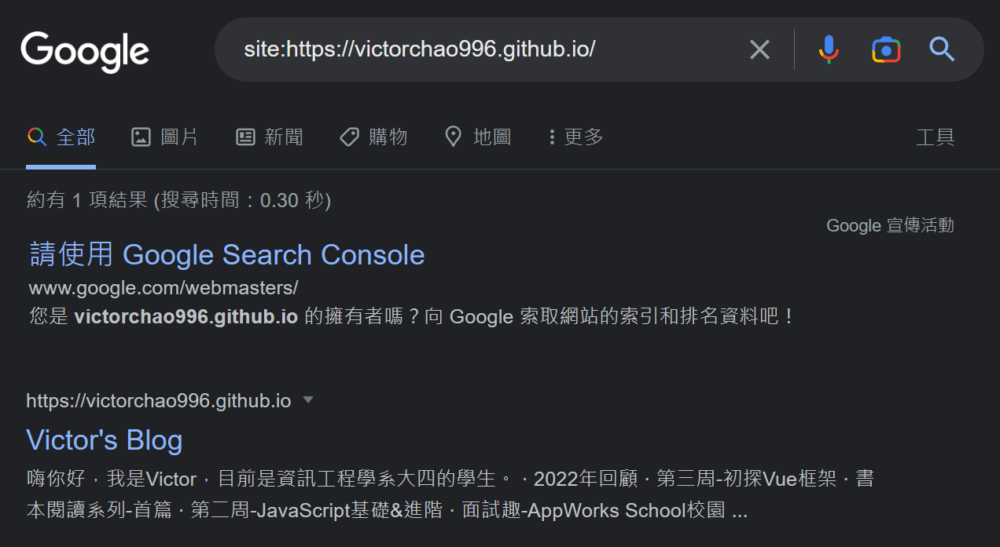
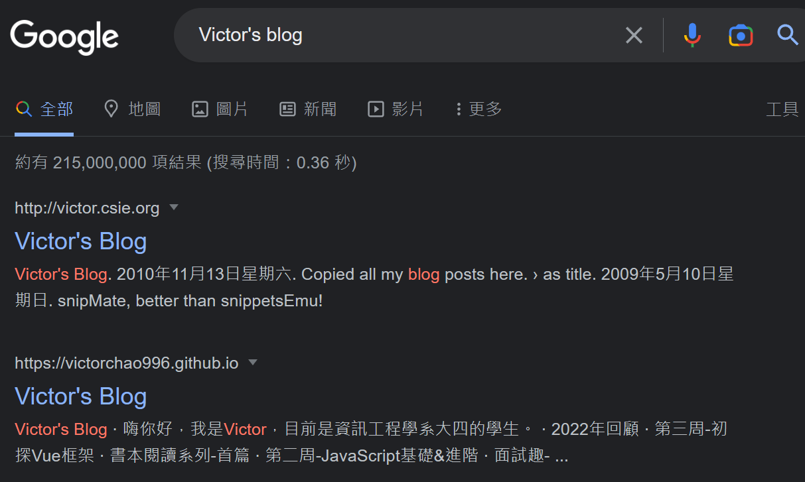
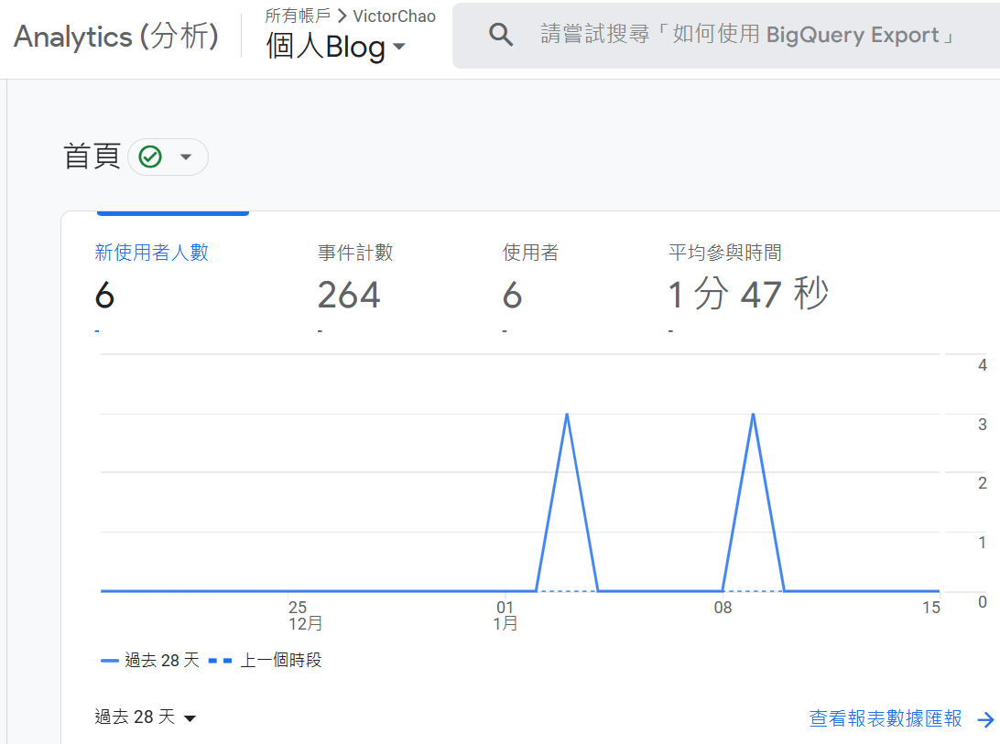

# 第五周-JS DOM、PR、GSC
## 前言
大四上學期的最後一周，雖說部分科目在上星期陸續就考完結束了，但這周仍有考試&部分課堂活動。於是我就趁著空閒的時間去玩一點不一樣的項目。


## 主要學習內容
### 1. JS HTML DOM 
在學習框架的過程中才發現自己對於DOM 的原理與操作不是很熟悉，於是就找了一些教材&影片打算將此遺漏的知識點給補齊。

#### 介紹
根據MDN web docs上對於DOM的解釋:
> The **Document Object Model** (_DOM_) is the data representation of the objects that comprise the structure and content of a document on the web.

簡單來說DOM就是將HTML文件內的各個element都定義成物件，而這些物件會形成的一個具有階層關係的**樹狀結構**。而JS可以透過DOM來改變HTML文件的內容。

#### 常見DOM操作
- 新增/刪除 element
- 更改element 的內容(text、HTML)
- 更改element的屬性(Attribute、Classes、CSS styles等)
- 對於HTML events做出反應
- 新增HTML events

#### 常見 Methods & Property
##### Adding/Deleting
- `document.createElement(element)`
- `document.removeChild(element)`
- `document.appendChild(element)`
- `document.appendChild(element)`
- `document.replaceChild(new, old)`
- `document.write(text)`
##### Finding
- `document.getElementById()`
- `document.getElementByClassName()`
- `document.getElementByTagName()`
- **`document.querySelector()`** : 選擇第一個符合的Element
- `document.querySelectorAll()`
##### Changing
- `element.innerHTML`
- `element.attribute`
- `element.style.property`
- `element.setAttribute()`

##### DOM Traversal (selecting)
- Children (下一代): `children()
- Descendants(孫子後)
- parents (上一代): `parentElement()`
- Ancestors(祖先): `closest()`
- Sibling(同輩): `nextElementSiblings()`、`previousElementSiblings`

有了以上不同的method就可以在JS中對HTML文件進行修改，以下為歸納出的步驟:
- 尋找(Finding/DOM traversal)->更換內容(Changing)
- 尋找->建立(Adding)
- 尋找->建立Event Listener

#### 範例:
```HTML
<div class="container">
  <textarea class="story"></textarea>
  <button id="set-text" type="button">Set text content</button>
  <button id="clear-text" type="button">Clear text content</button>
</div>
<script>
const story = document.body.querySelector(".story");

const setText = document.body.querySelector("#set-text");
setText.addEventListener("click", ()=>{
	story.textContent = "It was a dark and stormy night...";
})

const clearText = document.body.querySelector("#clear-text");
clearText.addEventListener("click", () => {
  story.textContent = "";
});
</script>
```

因為DOM操作涉及到 JavaScript events相關的內容，此時我才發現自己對於event的學習還不夠深入。目前僅知道click, mouse, keyboard等事件類別，對於events進階的觀念 等還不夠熟悉，這之後的坑要等到下星期再補齊了。

---
### 2. GitHub PR
本周學習的第二重點項目，gitHub 的 pull request。先前對gitHub的使用都只把它當作個人的程式碼備份平台，上傳練習時的程式碼。然而gitHub真正出名的地方在於可以**與其他人協作專案，結合git 版控實現真正的多人協作**。

#### 協作經驗
先前與他人協作開發的經驗包括使用Unity Collaborate、Gitea等，前者是Unity遊戲引擎編輯器的內建合作工具，後者則是基於git 版控工具的協作雲端平台(類似GitHub)。

前者因為專案主要的開發項目在我的本地端，所以沒有到太大的問題。而後者則是同一個專案中的不同部分由兩三個人去做開發(也就是沒有一端維護主要的程式碼)。

#### 檔案覆蓋問題
在開發的初期原先有規劃好說不去碰特定資料夾中的內容，避免merge時會有問題，然而意外卻還是不小心發生了。因為Unity專案中的資料與遊戲素材多又雜，導致我在清理檔案的時候不小心誤觸了開發資料夾以外的素材檔。當時的情況是**我誤刪了資料夾以外的資源檔案(地形檔)**，再加上我不小心把雲端的資料給覆蓋過去(不清楚為何能Push上雲端，也許是用了force指令?)，**導致另一人開發的關卡地形消失**。

鬧出了這麼大的鍋，好在最後經由Git將專案回朔到出事之前的版本才解決了版本不合的問題。在本周了解PR是怎麼一回事之後才發現，如果當初有學過這個操作，那是否就能避免檔案覆蓋的問題了呢?

#### PR的作用
當協作者想要將本地端的內容整合到雲端repo時，git push後會發送通知，**請求(Request)該repo的原作做拉(pull)的動作**，所以叫做Pull Request。

這麼做的好處是可以**避免其他協作者直接覆蓋檔案**，且原作在收到PR後可以**比對程式碼並做審核的動作**，而每一次PR提交都會有紀錄可以做為追蹤。

#### 第一次PR
為了做PR的練習，我找了gitHub上的一個名為[first-contributions]([firstcontributions/first-contributions: 🚀✨ Help beginners to contribute to open source projects (github.com)](https://github.com/firstcontributions/first-contributions))的Public Repo，他的ReadMe.md文件上有詳細的PR教學，造著說明一步一步做即可。我將其歸納為以下幾步:
1. fork 其他人的repo
2. clone repo到本地進行修改
3. 本地修改(通常會另開branch)，並commit
4. push 到自己的gitHub repo上
5. 提交PR
6. **原作者同意PR(將你的branch整合到他repo的branch上)**

根據以上的步驟，我完成了第一次的PR，也成為了該repo的contributor !

---

### 3. Google Analytics 與 Google Search Console
#### 搜尋???
先前架設好這個Blog後我就一直在想，既然有辦法透過URL連結到此網站，那能不能被Google 搜尋到呢? 出於好奇搜索了一遍，無奈的是即使下了很精確的關鍵字仍然沒有顯示在搜尋結果中。

後來爬了一些網路文章後才得知網站要被google收錄需要一段時間，但等不及的我於是上網找了能盡快被收錄的方法，也就是**主動向google登陸我的blog網站**。

#### GSC驗證
登陸的方法就是在Google Search Console上**驗證網站，並且提交sitemap.xml**，能讓網站早一點被收錄。google search console的驗證方法有很多種，而我很意外的選擇採用 **Google Analytics驗證** 。

通過驗證的方法就是將GA提供的一段HTML標記給放到網站的`<head>`之間，這樣GA就能驗證網站是否有被登錄。再花了不少時間後才將HTML標記給放到靜態網站建置的網頁中，也順利地通過GA的驗證。

有了GA的驗證後，GSC的驗證也順利地通過，最後一步就是等待提交的sitemap被處理。當過程順利完成後，在google 搜尋引擎中輸入 **site: 網址名** 即可在搜尋引擎中看到個人網站的連結。

#### 結果





我後來才發現GSC提供的驗證方法之一就包含在網站`<head>`中嵌入HTML標記的方式，只不過我意外地透過GA去驗證了GSC。結果就是我不僅完成了**網站的被搜尋功能，也順道完成了網站串聯GA分析**😂。



## 結語
這一周的學習內容並沒有著重在特定的主題，完全是興趣使然的結果，而我也在找尋資料並實作的過程中能慢慢地體會到**做中學的快樂** 。若是未來的學習過程都能如此有趣的話，那每天額外花個3小時專研技術根本就不是問題，畢竟是有趣的對吧? 

以上就是前端學習第五周的內容，下周開始是寒假的第一周，時間會充裕許多，我也能有更多的時間可以做學習，好好的充實自己。

---

- 參考資料:
	- [Adding Google Analytics to your Hugo Site :: Gideon Wolfe](https://gideonwolfe.com/posts/sysadmin/hugo/hugogoogleanalytics/)
	- [Hugo - Add Google Analytics | Justin James (digitaldrummerj.me)](https://digitaldrummerj.me/hugo-google-analytics/)
	- [2021經典版Google Analytics教學 教你看懂GA＆活用GA (shopjkl.com)](https://www.shopjkl.com/pages/ga)
	- [【完整指南】2022 Google Search Console教學(附索引問題處理) - SEO分解茶 (seo-tea.com)](https://www.seo-tea.com/google-search-console-tutorial/)