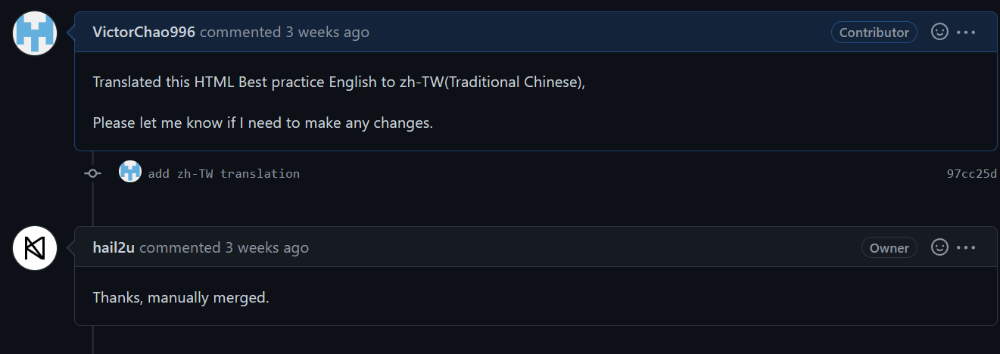

# 第六周-JS事件傳遞委派、貢獻GibHub專案
## 前言
本周是寒假的第一周，這周也是比較零散的學習&實作，簡單記錄一下。

## 學習與實作

### 1. JS Events 傳遞&委派
藉由網路影片與文章學習JS events 的進階知識，包括事件的傳遞機制(capturing、target、bubbling)等內容，並從事件傳遞的角度去看**事件委派(event delegation)** 所能帶來的好處。一開始接觸JS events可能會對events 傳遞的概念有疑問，不過在理解事件委派的概念後反而會覺得事件傳遞的機制設計很厲害，能以更有效率的方式綁定event listener。關於JS 詳細的筆記之後會再整理發布到blog上。

### 2. 實際通過PR
我在學習得過程中偶然找到一個關於HTML best practice的repository: [hail2u/html-best-practices: For writing maintainable and scalable HTML documents (github.com)](https://github.com/hail2u/html-best-practices)，裡面有著關於HTML最佳實務的.md 檔案，以及對應各種語言的翻譯檔。再看到這個repository的當下我就蹦出了我也許可以為這個文件做翻譯檔的想法，抱著試試看的心情，於是我就clone了repo到電腦上。

**翻譯的當下花了不少時間，但一想到我的付出也許能幫助到一些人就給了我繼續的動力**。儘管有簡體中文的翻譯文件可以參考，但是看完並修改全長1500行的文件也是花了不少時間。抱著忐忑的心情，我送出了第一個正式的PR。

與上一篇提到repo不同，這次的PR不是CI/CD自動審核的，而是真人審核並同意PR，好在最後成功通過PR，我也成為了該repo的contributor👍。

在做翻譯的過程中我慢慢地體會到 **" 開源共享、合作 "** 的觀念是多麼的難能可貴，大家無償的投入自己的時間來為這個社會貢獻一份心力。儘管我現在能力不足，還無法參與開源專案的開發，但能力不足者也有能貢獻一己之力的方法，**如: 翻譯文件、尋找專案bug等**。

## 總結
以上就是本周的學習喇，發現自己本周有大把時間都花在娛樂上了，實屬不應該。不過這儼然成為事實，我也沒辦法，只能將希望放在後面幾周了。下周農曆新年會放假一周，那這周的總結就先這樣。