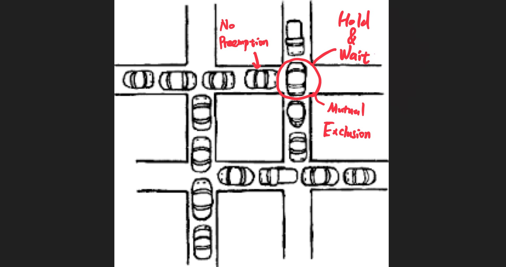

# 從Deadlock(死結)的觀點來分析黃色網狀線的作用
## 黃色網狀腺?
你是否有想過路口為什麼需要黃色網狀線? 也許你的直覺是清空路口，避免讓轉彎的車輛阻礙直行車通行，進而造成路口堵塞。那為什麼在路口設置黃色網狀線就可以有效的避免道路堵塞呢? 讓筆者從**作業系統(operation system)學科**中的觀念來解釋。 

## Deadlock 問題
資訊領域學生在學習作業系統(operating system)的過程中會了解到電腦系統通常**只有有限數量的資源**，這些資源包括CPU 週期、memory 空間、I/O裝置等。
對於數量較多的處理程序(processes)(要執行的程式)需要遵循以下三種順序來使用各種資源，而這三種動作分別是: **申請(request)、使用(use)、釋放(release)。**
給大家給舉個例子，若一個process在執行的過程中需要使用到印表機，此時"印表機"這個**資源**被process給佔用，同一時間其他Process無法使用印表機，不然印表機的輸出結果會錯亂。
而探討process與process間執行這三項動作時造成**資源等待&無法有效利用**的問題就叫做**Deadlock(死結)問題**。

## 造成Deadlock的四個必要條件
在教科書上有提到Deadlock的產生需要同時具備四個條件: **互斥(mutual Exclusion)、持有並等待(Hold & Wait)、非搶斷(No preemption)、循環等待(Circular Wait)**，以下分別是其簡短的介紹。

- **互斥(Mutual Exclusion)**: 至少有一個系統資源是每次只能被一個process使用。
- **持有並等待(Hold & Wait)**: 存在一個process在我持有某資源的同時，又在等待其他資源的釋放。
- **非搶斷(No Preemption)**: process在執行過程中(包括申請資源到結束執行前)不能被中斷，也就代表說process在完成前不會主動或被動釋放占用的資源。
- **循環等待(Circular Wait)**: 持有並等待的對象形成一個循環迴路。

當這四個條件同時滿足時，就會產生deadlock的情形。此時大家都在互相等待其他人手上的資源，但同時自己手上又握有其他人需要的資源，造成所有process都在等待，陷入死循環。

在學習的過程中意外的看到一張有意思的圖，下方的塞車圖很好的顯示deadlock的情況，並且若仔細觀察也會發現圖中包含上面提到的四個必要條件。

我們就上圖來討論造成死結的四個必要條件。
1. 互斥(Mutual Exclusion): 在此圖中**一次只能有一個車輛通過十字路口**，所以路口這個資源符合互斥的條件
2. 持有並等待(Hold & Wait): 在此圖中路口的車輛占住了路口這個資源，但**同時又在等待下一個十字路口的暢通**
3. 非搶斷(No preemption): 很顯然的，被擋住的汽車無法穿過阻擋車，且佔住路口的汽車也不會憑空消失。
4. 循環等待(Circular Wait):  都在等待下一個路口淨空而產生**循環等待**。
觀察上圖應該可以發現，沒有一台車可以移動，這就是deadlock發生時的狀況。

那我們要如何避免deadlock(道路阻塞)的情況發生呢? 聰明的你應該立馬就想到了，那就是**打破造成死結的其中一個必要條件**即可 !

## 打破Deadlock!
那我們應該要從哪一點下手呢? 剛剛有解釋塞車圖中分別對應滿足死結的四種條件，其中第三點(非搶斷)是無法解決的，除非車子可以飛起來或穿透障礙物😂；而第四點(循環等待)因為道路設計的關係，只要持有並等待的條件滿足就有可能產生循環等待的狀況，所以一樣無法排除。這樣一來，我們能改善的點就只有第一點&第二點了。

所以目前有兩種改進方法: 打破互斥&打破持有並等待，現在回顧上圖可以發現這兩點出現的位置**皆在路口處**，所以我們可以針對十字路口處來做改善。

其中一個改善的方法就是**拓寬十字路口**，使得路口可以容納更多的車子；然而這樣還是有一個問題，若十字路口上的車子數量又達到上限時，又會產生deadlock。而剩下最後一個改進方式就是**打破持有&等待**，只要**不要讓單一車子/或一群車子佔有十字路口這個"資源"**即可，也就是限制車子不得停在十字路口上。這樣就可以有效的避免deadlock的產生，也就比較不容易造成阻塞囉 ! 

現在你應該能明白，為什麼要在十字路口設置黃色網狀線了。除了保持路口暢通外，還可以有效避免一定範圍內的塞車情況。雖然避免deadlock並不是主要的目的，畢竟大十字路口上有紅綠燈管制，而小巷子也不會有有這麼多車同時進入。現實世界的道路往往更複雜也更難預料，不過做為道路設計與規劃的一部分還是很值得探討的。

**圖片素材來源**
- 封面圖片: https://m.facebook.com/chengxiungmath/photos/a.104541441121276/418554636386620/
- 塞車圖片: https://denninginstitute.com/itcore/processes/Dead.html