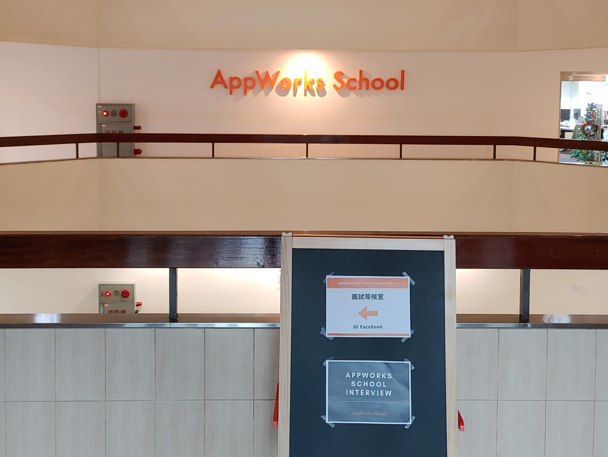

# AppWorks School Campus Program 面試
## 前言介紹
偶然在網路上看到AppWorks School最近開放報名**第三屆的校園培訓計畫**，再加上平常在聽的Podcast節目"程人頻道" 的最新一集就是校長Shirney分享AppWorks School的理念&培訓營的介紹後，就萌生了也許我可以參加的想法。於是在看過校園計劃的課程說明&網路上的公開心得分享後就直接手刀報名。

## 深入了解Schools
在詳細研究AppWorks School前只知道他是一個培育機構，專門針對想要轉職成為軟體工程師的朋友提供培訓的課程，至於實際如何運作並不清楚。

後來從官方Youtube說明會上說明會影片中了解到AppWorks School是整個AppWorks Ecosystem中的一環，而最早AppWorks是先有AppWorks 加速器，之後更近一步有了AppWorks Fund (基金)。有了新創團隊，有了資金，接下來就剩下的就是人才的部分，於是在2016年就創立了AppWorks School。

在了解整個生態系的運作後對於School "想要為台灣培育出優秀的軟體工程師" 的理念更加的認同，也解開了我心中為何在School 這邊培訓可以完全免費的疑惑。

剛好今年開了給資訊本科系學生的Campus Program，我想了想機會難得，於是就填了報名表單，最終也順利收到面談邀約。

## 準備階段
準備的過程不外乎的就是先把網路所有公開心得文章都看過一遍，雖然與Schools Program有關的只有3篇，但是轉職班的心得文我也是略看略看。

值得一提的是，文章不僅沒有誇，張的吹噓，反而是很真實的呈現在School學習的階段遇到的各種事情。例如說很多學員在參與的過程中充滿挫折，畢竟一周中要投入巨量的時間，而且每天都接觸自己不熟悉的事物，心態很容易崩。對於要在短短幾個月內就轉職成為軟體工程師肯定沒有這麼簡單，這也是幾乎每一篇心得文都說培訓過程很痛苦。**然而培訓的過程中學員都會互相幫助或加油打氣，在朝夕相處下逐漸與其他人培養共患難的精神**，這也難怪大家都很推進入School 磨練自己。

除了文章，我把AppWorks School 官方的IG、Youtube都大致看過一遍。除了線上校園說明會的影片外，我也看了一些轉職軟體工程師的分享影片給看完，**我發現自己愈了解AppWorks School ，愈想要進到AppWorks School中做學習。**

在面試前針對可能會被問到的問題一一做了合適的回答整理，除此之外也從家人那獲得寶貴的建議，例如履歷要如何修改，面試準備方向等。為了這次的面談的準備我可是使出渾身解數，把我能做的準備都做了。

## 面試過程
面談當天我起的一大早，從學校(中壢)座車到台北花了不少時間，不過幸好我約的時間是11:30，在經過各總轉車後於10點左右到School 附近。

11:15抵達八樓Appworks School開放區域，並根據指定地點到會議室裏面等待。

> 還記得左邊是面試等待的會議廳，而右邊的辦公室剛好在拍攝。

在等待的過程中聽到會議室中的小門傳出對談的聲音。從上一位面試者離開，一直到11:30 接引我進去的Luna 出來之前緊張到不行，若2022年有最佳緊張時刻排名，那在等待的那10分鐘肯定得獎。

進入小間的會議室，裡面只有兩位: 一位是School Program的Manager Carolyn，另一位是寄出面談邀約信的 Luna。我原本以為會有校長或是前後端的任一位導師也在旁邊陪聽，不過看來果真是跟網路描述上的一樣，面談主要是想看看**各位應徵的學員的動機，而不是過往的經歷。**

### 面試問題
面試的問題我有印象的主要有幾個:
1. 請你自我介紹一下
2. 對於未來的打算?
	1. 你有提到實習，所以你下學期打算一邊實習一邊跑Schools 這邊?
3. 你今天從哪裡來? 
4. 你是哪裡人?
5. 人生至今為止面對的低潮?
	1. 你現在還在低潮中嗎?
6. 為什麼想要參加Program? (類似)
7. 預計投入的時間?
8. 如果你沒有最終沒有成功錄取，你會做那些準備或是事情來面對之後的工作 ?
9. 有沒有想要問我們的問題 ?
10. 等等面談結束後有什麼打算嗎?

### 過程中
講的中規中矩，印象中講到一半手還會抖，真的頗緊張。不過跟我面談的兩位很盡力的表現出只是想要跟我聊聊，而不是要扮黑臉刷掉我，這也讓我比較沒有這麼緊張。

在回答問題的過程中我盡力展現自己的真誠，把我所能回答的想法都告訴兩位。**我認為比較可惜的是，我準備好回答的問題並沒有出現，而我也忘記在回答原本的問題之餘可以把話題導向我想要表達的事項上**。

面談的後段兩位突然問我擅長的程式語言，在我回答完後就給我一張紙上面有C++程式碼要我說明該function的功能。當下完全沒預料到會有程式題，不過也是順利的完成這一part。

面談的過程除了緊張外還算順利，三十分鐘很快就過去了。對於邊緣人來說，我講話沒有結巴已經很不錯了，但面談完的當下能感受到自己引導話題的部分仍然有很大的進步空間。

## 自我檢討
為了避免這整篇文流於流水帳(好啦 其實已經是了)，關於面試得過程就不再細談，接下要做一點自我檢討。

### 行為檢討
1. 一開始太緊張導致語速稍快，面談的兩位可能聽不清楚
2. 在思考回答的時候眼神會不自覺的往上飄，不太確定這樣會不會被認為是在說謊
### 回答檢討
1. 回答的時候沒有提及參與多人專案的過程
2. 沒有展現自己很好的利用學校的資源: **English Cafe、企業博覽會、職涯中心講座、去企業參訪**。
3. 對於前端的學習過程解釋不是很清楚
4. 如何學習新知識的過程解釋的不清楚
5. 在看程式題的過程中太安靜
	1. 應該要問除了回答function的功能外，還需不需要做其他改進
	2. 解釋function的過程很爛
6. 在最後問問題環節只問了一個問題
	1. 應該要把握機會問，例如對於School 來說學員應該要具備什麼樣的特質是比較好的

## 總結
面完的當下就很想要重來一次，不過時間無法倒流，期許自己好好把握每一次學習的機會。做為人生第一次正式的面試，雖然過程只有短短半小時，而且也不是工作相關的，不過我認為這是非常難得的學習機會，我也很慶幸自己踏出這一步。

非常感謝Appsowrk School給我這面談的機會，在準備面談的過程中我明確了解自己有非常多的不足，值得我投入時間去改善學習。另外在這兩三周忙碌的準備中也將我從低潮中抽離出來，使我能不再把注意力放在那些會讓我焦慮的想法上。

第一次的面試心得就分享到這，下一站會去哪呢? 面試趣，我們下一篇再見。

## 後記
我在2023/1/3收到錄取通知啦!!! 感謝當初有付出行動的我，希望加入program之後依切順利。