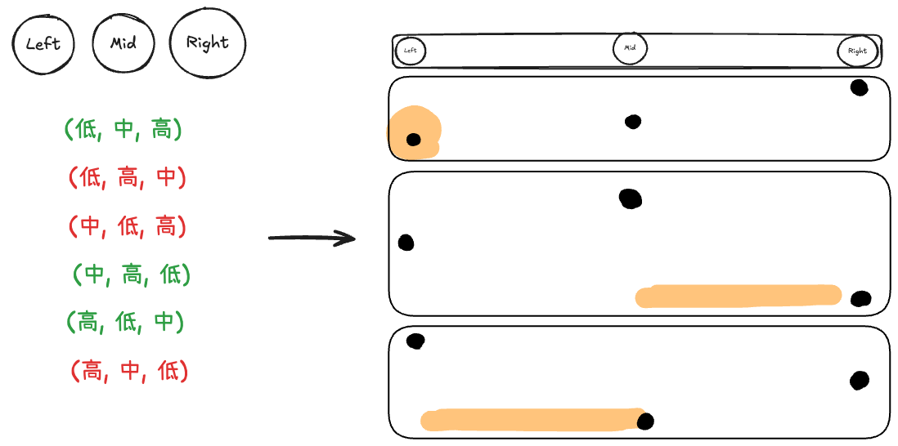
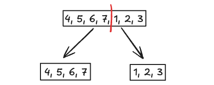

# Leetcode Practice w10
## 前言
本週是 leetcode weekly practice 的第10週, 這次一樣總共三題, 其中 ３ 題都是 Medium。其中有一題跟 Tree 有關, 另外兩題則是與 Binary Search 有關 , 那我們一樣直接進入題目環節。 

## 題目

### 1 -  Kth Smallest Element in a BST
Leetcode [第 230 題](https://leetcode.com/problems/kth-smallest-element-in-a-bst/), 以下為原文：
```
Given the root of a binary search tree, and an integer k, return the kth smallest value (1-indexed) of all the values of the nodes in the tree.

Example 1:
Input: root = [3,1,4,null,2], k = 1
Output: 1

Example 2:
Input: root = [5,3,6,2,4,null,null,1], k = 3
Output: 3
 
Constraints:
The number of nodes in the tree is n.
1 <= k <= n <= 104
0 <= Node.val <= 104
```

> ex2 graph

題目要求：
*input 一個 BST 的 root node & number K, 求這個 BST 中第 K 小的 node 的 value*

這一題還滿簡單的, 與 [leetcode w9](./leetcode_w9.md) 中的其中一題 [Validate Binary Search Tree](./leetcode_w9.md#2---validate-binary-search-tree) 的其中一個解法使用 inorder 一樣, **這邊一樣用 valid BST 在 inorder 下 node value 為 asc sorted 的特性來解此題**。直接上參考解：

```JS
function kth_smallest_in_BST(root, k){
	const a = [];
	function inorder(node){
		if(!node)
			return;
		inorder(node.left);
		a.push(node.val);
		inorder(node.right);
		return;
	}
	inorder(root);
	return a[k-1];
}
```

上述解法先 inorder 遍歷一遍整個 BST 並將 node value 存在 array 中, 最後再返回指定的第 Ｋ 小元素即可。其中 Time Complexity 為 O(n), Space Complexity 為 O(n + n) => O(n).

我們可以進一步利用 inorder 走訪的順序計算要取得的值, 便可以在 constant space 底下解（不包含 recursive stack）：

```JS
function kth_smallest_in_BST(root, k){
	let result;
	function inorder(node){
		if(!node)
			return;
		inorder(node.left);
		k--;
		if(k == 0)
			result = node.val;
		inorder(node.right);
		return;
	}
	inorder(root);
	return result;
}
```

既然能用 recursive 進行 inorder, 那其實也可以用 stack 來 iterative 的達成一樣的遍歷：

```JS
function kth_smallest_in_BST(root, k){
	let current = root;
	const stack = [];
	while(current || stack.length > 0){
		while(current){
			stack.push(current);
			current = current.left;
		}
		current = stack.pop();
		k--;
		if(k == 0)
			return current.val;
		current = current.right;
	}
}
```
> 註：這邊用 JS list 替代 stack, 實際上兩者在 pop() 時的時間複雜度不相同

以上參考解的 Time Complexity 為 O(k) => O(n), Space Complexity 則為 O(n+1) => O(n)。

### 2 - Find Minimum in Rotated Sorted Array
Leetcode [第 153 題](https://leetcode.com/problems/find-minimum-in-rotated-sorted-array/), 以下為原文：
```
Suppose an array of length n sorted in ascending order is rotated between 1 and n times. For example, the array nums = [0,1,2,4,5,6,7] might become:
[4,5,6,7,0,1,2] if it was rotated 4 times.
[0,1,2,4,5,6,7] if it was rotated 7 times.
Notice that rotating an array [a[0], a[1], a[2], ..., a[n-1]] 1 time results in the array [a[n-1], a[0], a[1], a[2], ..., a[n-2]].
Given the sorted rotated array nums of unique elements, return the minimum element of this array.
You must write an algorithm that runs in O(log n) time.

Example 1:
Input: nums = [3,4,5,1,2]
Output: 1
Explanation: The original array was [1,2,3,4,5] rotated 3 times.

Example 2:
Input: nums = [4,5,6,7,0,1,2]
Output: 0
Explanation: The original array was [0,1,2,4,5,6,7] and it was rotated 4 times.

Example 3:
Input: nums = [11,13,15,17]
Output: 11
Explanation: The original array was [11,13,15,17] and it was rotated 4 times. 
 
Constraints:
n == nums.length
1 <= n <= 5000
-5000 <= nums[i] <= 5000
All the integers of nums are unique.
nums is sorted and rotated between 1 and n times.
```
題目要求：
*給一個從小大到排序過後的 number array, 其中定義此 array 的 “旋轉”, 將首位數字放到陣列的最後一位, 其他數字依序往前遞補。題目的 input 可以為經過任一旋轉 n 次的 array, 求此 input array 中的最小值。*

這一題原本的要求若是用 O(n) 解太過於 trivial, 亦即掃過 array 一遍並找出最小的 value, 所以題目加上一個限制, 要求寫的演算法的時間路雜度為 O(log n) 之內。敏銳的讀者在看到 log n 時, 第一反應基本就要想到二分法 (Binary Search), 因為不斷地將題目切成一半, 所以搜尋的平均時間可為 log n (註
：底數為 2), 這題也是類似, 重點在於找出搜尋前半段或後半段 array 的規律。

我們可以將 input array 依大小分成三種類型：

1. 長度為 1 -> 直接返回
2. 長度為 2 -> 返回兩者中最小值
3. 長度為 3 及以上 -> 根據 left, mid, right 決定三者之間的關係

前兩個還算好理解, 那第三個呢？其實就是將 left, mid, right 所有可能的排列組合列出來再根據 “旋轉” sorted array 的特性來猜想最小值會出現在哪一個位置, 進而選擇下一個要搜尋的是前半或後半區間。
來看以下為參考解：

```JS
function find_minimum_in_sorted_array(nums){
	const len = nums.length;
	if(len == 1)
		return nums[0];
	if(len == 2)
		return Math.min(nums[0], nums[1]);
	
	let left = 0, right = len-1;
	while(left < right){
		const mid = Math.floor((left + right)/2);
		if (nums[mid] > nums[mid + 1]) return nums[mid + 1];

		if(nums[left] < nums[mid] && nums[mid] < nums[right])
			return nums[left];
		else if(nums[mid] < nums[left] && nums[mid] < nums[right]){
			right = mid;
		}
		else if(nums[mid] > nums[left] && nums[mid] > nums[right]){
			left = mid
		}
	}
}
```

此題的關鍵在於找到那個 pivot point, 也就是最大值 or 最小值, 以上述的例子中, 在陣列所有可能的相鄰組合中唯一前者比後者大點即為我們要找的點。這邊我們假設依據某一策略最終能在 mid 的位置找到 pivot point, 接下來的重點就是, 這邊做 Binary Search 的策略為何？

其實並沒有想像中的那麼難, 將 left, mid, right 的高低排列組合條列出來即可, 參考下方示意圖：



將所有可能的排列組合列出來後會發現, 只有其中三種符合 input array asc sorted 後的特性, 換句話說, 我們只要依據這三種可能性去判斷 Binary Search 的策略。

觀察上圖, 在 "中高低" 組合中, 正常的 asc 排序下 right 的值理論上會比 mid 來得高的, **而這邊較低代表說在 mid ~ right 之間出現的最大值, 而其後一位便為 array 最小值**, 所以在這種可能性下, 我們選擇 Binary Search 後半區間。

在看另一個組合 "高低中", 也是一樣的道理, 最大值 (也就是 pivot point) 勢必出現在 left ~ mid 這個區間內, 所以在這種可能下, 我們選擇 Binary Search 前半區間。

最後我們來看最後一種組合, "低中高", 這個非常直觀, 根據排序, 在這種可能性下, left 的位置一定是區間內的最小值, 因此為解答。

藉由策略 Binary Search 尋找此題的 pivot point 便能夠在平均 Time Complexity 為 O(log n) 下得到解答, 而 Space Complexity 則為 O(1)。


此題還有解法類似, 但是概念上大同小異的解法, 來看以下參考解：

```JS
find_minimum_in_sorted_array(nums){
	let result = nums[0];
	let l=0; r=nums.length-1;
	while(l <= r){
		if(nums[l] < nums[r]){
			result = Math.min(result, nums[l])
			break;
		}
		let m = Math.floor((l + r)/2);
		result = Math.min(result, nums[m]);
		if(nums[m] >= nums[l]){
			l = m + 1;
		}else{
			r = m - 1;
		}
	}
	return result;
}
```

此參考解是**根據 mid 在左 sorted 或 右 sorted 區間來決定 Binary Search 要選擇的區間**, 當 mid 比 left 大時, 代表兩者同時在左 sorted 區間, 而此時最小值會出現在 mid ~ right 間, 反之, 當 mid 比 left 小時, 代表 mid 與 right 同時在右 sorted 區間, 此時最小值則會出現在 left ~ mid 間。

以上參考解的平均 Time Complexity 為 O(log n), Space Complexity 則為 O(1)。

### 3 - Search in Rotated Sorted Array
Leetcode [第 33 題](https://leetcode.com/problems/search-in-rotated-sorted-array/), 以下為原文：
```
There is an integer array nums sorted in ascending order (with distinct values).
Prior to being passed to your function, nums is possibly rotated at an unknown pivot index k (1 <= k < nums.length) such that the resulting array is [nums[k], nums[k+1], ..., nums[n-1], nums[0], nums[1], ..., nums[k-1]] (0-indexed). For example, [0,1,2,4,5,6,7] might be rotated at pivot index 3 and become [4,5,6,7,0,1,2].

Given the array nums after the possible rotation and an integer target, return the index of target if it is in nums, or -1 if it is not in nums.

You must write an algorithm with O(log n) runtime complexity.

Example 1:
Input: nums = [4,5,6,7,0,1,2], target = 0
Output: 4

Example 2:
Input: nums = [4,5,6,7,0,1,2], target = 3
Output: -1

Example 3:
Input: nums = [1], target = 0
Output: -1
 
Constraints:
1 <= nums.length <= 5000
-104 <= nums[i] <= 104
All values of nums are unique.
nums is an ascending array that is possibly rotated.
-104 <= target <= 104
```
題目要求：
*給一個從小大到排序過後的 number array, 其中定義此 array 的 “旋轉”, 將首位數字放到陣列的最後一位, 其他數字依序往前遞補。input 一個 "選轉" 過的 sorted array (asc) 與 target K, 求 target K 在 sorted array 中的位置, 若不存在則返回 -1*

這題與上一題的類似, 不過題目的要求從尋找最小值變成找指定的值是否存在陣列中。在這之前我們先來看原始版本的 [Binary Search 題目](https://leetcode.com/problems/binary-search/) 內容：

#### Binary Search Problem

```
Given an array of integers nums which is sorted in ascending order, and an integer target, write a function to search target in nums. If target exists, then return its index. Otherwise, return -1.

You must write an algorithm with O(log n) runtime complexity.

Example 1:
Input: nums = [-1,0,3,5,9,12], target = 9
Output: 4
Explanation: 9 exists in nums and its index is 4

Example 2:
Input: nums = [-1,0,3,5,9,12], target = 2
Output: -1
Explanation: 2 does not exist in nums so return -1
 
Constraints:
1 <= nums.length <= 104
-104 < nums[i], target < 104
All the integers in nums are unique.
nums is sorted in ascending order.
```

題目要求：*給一個從小到大排序過的數字 array 與 target K, 求 k 在陣列中的位置, 若不存在則返回 -1*

此題是 Binary Search 最基礎的題目, 最能一窺 BS 的核心思想, **也就是根據策略將搜尋的範圍變成原先的 1/2** , 來看以下參考解：

```JS
function BinarySearch(nums, target){
	let l=0, r=nums.length-1;
	while(l <= r){
		const m = Math.floor((l+r)/2);
		if(nums[m] == target){
			return m;
		}else if(nums[m] > target){
			r = m - 1;
		}else{
			l = m + 1;
		}
	}
	return -1;
}
```

BS 將搜尋的範圍分成前半段與後半段, 那該如何選擇哪一半段呢？以此題的狀況來說, 我們可以直接判斷 middle point 與 target 的相對大小, 若 mid val > target 代表說 target 勢必會出現在搜尋範圍的前半段; 反之, 當 mid val < target 時, 表示 target 勢必出現在搜尋範圍的後半段。當 BS 策略出來後, 剩下再處理結束時的條件即可。

BS 的核心概念就是這麼簡單 ! 難的點在於找出對每個題目適用的搜尋策略與邊界處理 🤔


我們回到原本的問題, 要如何在 rotated sorted array 中選擇合適的搜尋策略呢？來看以下概念圖：



與上一題解二的概念類似, 無論 input array 怎麼旋轉都可以分為兩個部分, 左 sorted array & 右 sorted array (兩者不一定等長), 我們先確認 mid 是位於哪一個區間中, 再根據 sorted 的特性來選擇前半段或後半段。來看以下參考解：

```JS
function SearchInRotatedSortedArray(nums, target){
	let left = 0,
		right = nums.length - 1;

    while (left <= right) {
        console.log(left, right);
        let mid = Math.floor((left + right) / 2);
        if (nums[mid] == target) return mid;

        //mid 在左 sorted array 中
        if (nums[left] <= nums[mid]) {
	        //前半區間保證 sorted, 可以直接搜尋
            if(nums[left] <= target && target <= nums[mid]){
                right = mid - 1;
            }else{
                left = mid + 1;
            }
        } //mid 在右 sorted array 中
        else{
	        //後半區間保證 sorted, 可以直接搜尋
            if(nums[mid] <= target && target <= nums[right]){
                left = mid + 1;
            }else{
                right = mid - 1;
            }
        }
        
    }
    return -1;
}
```

個人認為此題在實作上最困難的點在於, **要釐清你搜尋的範圍是否合理**, 以下圖 example 來看, 此圖的 mid 在左 sorted array , 保證 left ~ mid 都是排序好的狀態, 在這樣的條件下, 去判斷 target 的值是否位於 left, mid 兩者之間才有意義。例如：當 target 為 2 時, left (4) < target < right (7) 的條件並沒有被滿足, 推測 target 出現在後半段, 所以移動 left。


反之, 當 left~mid 不是排序好的狀態 (也就是 mid 位於 右 sorted array 時), left < target < mid 的條件就不適用於判斷 target 是否位在前半或後半段, 所以此時要換成判斷 mid < target < right。像 example 題, 若 target 為 2 , 使用 mid (7) < target (2) < right (3) 顯然不合理。

上述參考解的 Time Complexity 為 O(log n), Space Complexity 為 O(1)

## 結語
這週開始碰 Binary Search, 以前在學校學的時候沒什麼感覺, 但在徹底了解並寫完這三題後, 終於有了解到 BS 核心思想的魅力。記住這個概念：**利用策略將搜尋範圍縮小到原先範圍的 1/2**

那本週的 leetcode 挑戰就到這, 我們下週繼續～