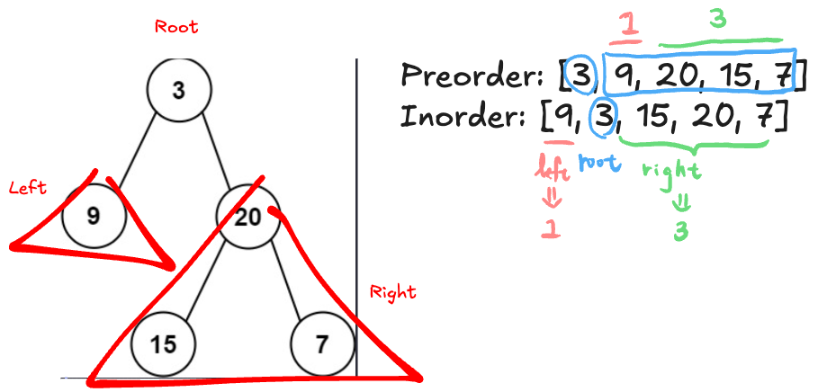

# Leetcode Practice w11
## 前言
本週是 leetcode weekly practice 的第 11 週, 年關將近, 再過一週就要過農曆新年了, 不確定下兩週會不會沒有時間（或沒有心力）練習 leetcode。 下兩週的狀態只能到時候再確認了, 在此之前, 本週得挑戰文還在繼續中。本週一樣共三題, 其中 1 題 Easy , 2 題 Medium, 都是與 **Binary Tree** 這個概念相關, 那我們一樣直接進入題目環節。 

## 題目

### 1 - Subtree of Another Tree
Leetcode [第 572 題](https://leetcode.com/problems/subtree-of-another-tree/), 以下為原文：
```
Given the roots of two binary trees root and subRoot, return true if there is a subtree of root with the same structure and node values of subRoot and false otherwise.

A subtree of a binary tree tree is a tree that consists of a node in tree and all of this node's descendants. The tree tree could also be considered as a subtree of itself.

Example 1:
Input: root = [3,4,5,1,2], subRoot = [4,1,2]
Output: true

Example 2:
Input: root = [3,4,5,1,2,null,null,null,null,0], subRoot = [4,1,2]
Output: false
 
Constraints:
The number of nodes in the root tree is in the range [1, 2000].
The number of nodes in the subRoot tree is in the range [1, 1000].
-104 <= root.val <= 104
-104 <= subRoot.val <= 104
```

> ex1 graph


> ex2 graph

題目要求：
*input 一個 tree 的 root node (root), 與另一個 tree 的 root node (subRoot), 判斷後者是否為前者的 subTree, 是則返回 true, 不是則回 false*

這一題不會很難, 也非常好理解, 如果有先寫過另一題 Easy 題 [Same Tree](./leetcode_w9.md#1----same-tree) 的話, 那本題實際上要確認的就是, **對於每一個 node 開展的 tree, 是否與 subRoot tree 相等**, 直接來看以下考解：

```JS
function isSubtree(root, subRoot){
	const q = [root];
	let result = false;
	let current;
	while(q.length > 0){
		current = q.shift();
		if(current.val == subRoot.val)
			result = result || sameTree(current, subRoot);
		if(current.left)
			q.push(current.left);
		if(current.right)
			q.push(current.right);
	}
	return result;
}

function sameTree(n1, n2){
	if(!n1 && !n2)
		return true;
	if(!n1 || !n2 || n1.val != n2.val)
		return false;
	return sameTree(n1.left, n2.left) && sameTree(n1.right, n2.right);
}
```

因為子樹可能出現在任意位置, 所以必須要對**每一個必要的** root node 都做一次 sameTree 的檢查, 以上述例子來看, 當當前 node.val 與 subRoot.val 相等時就會進行一次完整的比較。依據這樣的策略, 此題的平均 Time Complexity 為 O(m * n), 其中 m 為 root node 數量, n 為 subRoot node 的數量 （**最差情況下, 每一個 root node 都要進行 sameTree 的比較**）, 而 Space Complexity 則為 O(m)

### 2 - Lowest Common Ancestor of a Binary Search Tree
Leetcode [第 235 題](https://leetcode.com/problems/lowest-common-ancestor-of-a-binary-search-tree/), 以下為原文：
```
Given a binary search tree (BST), find the lowest common ancestor (LCA) node of two given nodes in the BST.

According to the definition of LCA on Wikipedia: “The lowest common ancestor is defined between two nodes p and q as the lowest node in T that has both p and q as descendants (where we allow a node to be a descendant of itself).”

Example 1:
Input: root = [6,2,8,0,4,7,9,null,null,3,5], p = 2, q = 8
Output: 6
Explanation: The LCA of nodes 2 and 8 is 6.

Example 2:
Input: root = [6,2,8,0,4,7,9,null,null,3,5], p = 2, q = 4
Output: 2
Explanation: The LCA of nodes 2 and 4 is 2, since a node can be a descendant of itself according to the LCA definition.

Example 3:
Input: root = [2,1], p = 2, q = 1
Output: 2
 
Constraints:
The number of nodes in the tree is in the range [2, 105].
-109 <= Node.val <= 109
All Node.val are unique.
p != q
p and q will exist in the BST.
```

> ex1 graph


> ex2 graph

題目要求：
*input 一個 tree 的 root node 與 其中的任一兩個 node: p, q, 求 p & q 的最小共同祖先 node*

首先我們可將問題分成以下四種狀況：

1. root.val 介於 p.val & q.val 間
2. root.val 大於 p.val & q.val
3. root.val 小於 p.val & q.val
4. root.val == p.val 或 root.val == q.val (同狀況一處理)

這一題的我們可以利用 Binary Search Tree 的特性 （對於所有 node, 其所有 left sub node 值皆小於自身, 而其所有 right sub node 值皆大於自身, 換句話說: **所有在 left sub tree 中的 node 值皆小於 root node, 而所有在 right sub tree 中的 node 皆小於 root node**) 觀察範例圖, 當狀況一出現時, 表示 p, q 分別落在左右子樹中 (例：p=0, p=8); 當狀況二出現時, 表示 p,q 皆為於左子樹中 (例: p=0, q=4); 當狀況三出現時, 表 p, q 皆位於右子樹中 (例: p=8, q=9)。

利用以上的選擇策略, 便可持續的縮小搜尋的範圍, 直到找到解答, 來看以下參考解：

```JS
function lowestCommonAncestor(root, p, q){
	if(!root)
		return null;
		
	if((root.val > p.val) && (root.val > q.val)){
		return lowestCommonAncestor(root.left, p, q);
	}else if((root.val < p.val) && (root.val < q.val)){
		return lowestCommonAncestor(root.right, p, q);
	}else{
		return root;
	}

}
```

利用策略且妙的從上往下逐漸縮小搜尋的範圍, 直到找到 common ancestor 後, 再向上傳遞。上述參考解的 Time Complexity 為 O(h) => O(log n), Space Complexity 也為 O(h) => O(log n)。

上述參考解是利用 recursive 解, 但其實我們可以省略 recursive 向上傳遞的步驟, 直接將 Top Down 搜尋轉換成 iterative 方式實作：

```JS
function lowestCommonAncestor(root, p, q){
	let current = root;

	while(current){
		if(current.val > p.val && current.val > q.val){
			current = current.left;
		}else if(current.val < p.val && current.val < q.val){
			current = current.right;
		}else{
			return current;
		}
	}
	return null;
}
```

這樣實作便可節省 recursive stack 的 space 消耗, 此參考解的平均 Time Complexity 為 O(h) => O(log n), Space Complexity 則為 O(1)。

### 3 - Construct Binary Tree from Preorder and Inorder Traversal
Leetcode [第 105 題](https://leetcode.com/problems/construct-binary-tree-from-preorder-and-inorder-traversal/), 以下為原文：
```
Given two integer arrays preorder and inorder where preorder is the preorder traversal of a binary tree and inorder is the inorder traversal of the same tree, construct and return the binary tree.

Example 1:
Input: preorder = [3,9,20,15,7], inorder = [9,3,15,20,7]
Output: [3,9,20,null,null,15,7]

Example 2:
Input: preorder = [-1], inorder = [-1]
Output: [-1]

Constraints:
1 <= preorder.length <= 3000
inorder.length == preorder.length
-3000 <= preorder[i], inorder[i] <= 3000
preorder and inorder consist of unique values.
Each value of inorder also appears in preorder.
preorder is guaranteed to be the preorder traversal of the tree.
inorder is guaranteed to be the inorder traversal of the tree.
```

> ex1 graph

題目要求：
*input preorder array & Inorder array 分別表示同一個 tree 的在 preorder ＆ inorder 順序下, 各個 node value 的順序, 其中 array 不包含 null, 且 tree 的每一個 node value 保證唯一。*

這一題又是一個非常有趣的, ~~不知道是誰想出來的神奇題目~~, 明白概念之後不會很難 (所以難度為 Medium), 但是要自己摸索並且實作出來沒想像中的簡單。在分享參考解前我們來整理目前已知資訊, 首先是 preorder 的走訪順序為 **root -> left sub tree -> right sub tree**, 而 inorder 走訪的策略為 **left sub tree -> root -> right sub tree**。 

根據以上的資訊我們推出以下的結論：

1. root 必定在 preorder array 的第一個位置 (preorder[0])
2. left sub tree 的所有 node 在 inorder array 中皆為在 root 之前 (左側), 反之 right sub tree 的所有 node 皆為在 root 之後 (右側)

來看以下示意圖：




其中第二點尤其重要, 是構建整個 tree 的核心概念, 利用以上兩點我們便能透過遞迴的方式將題目要求的 tree 給 build 出來, 以下為參考解：

```JS
function buildTree(preorder, inorder){
	if(preorder.length == 0 && inorder.length == 0)
		return null;
	const root = new TreeNode(preorder[0]);
	const root_index = inorder.indexOf(preorder[0]);
	root.left = buildTree(preorder.slice(1,root_index+1),inorder.slice(0, root_index));
	root.right = buildTree(preorder.slice(root_index+1), inorder.slice(root_index+1));

	return root;

}
```

上述參考解的代碼雖然簡潔, 不過平均 Time Complexity 與 Space Complexity 皆為 O(n^2), 其中對於每一個要遍歷的 node (preorder element) 都用 indexOf 去尋找其在 inorder array 中的位置 (O(n)), 所以整體時間複雜度較高; 而 Space Complexity 則是在遞迴的過程中回不斷的需要額外的空間儲存新的 preorder & inorder (n + (n-1) + (n-2) + ... + 2 + 1), 所以整題複雜度也為 O(n^2)。

關於 Time Complexity **我們可以將 find index 的部分用 hashmap 來降低尋找的時間**, 來看以下參考解：

```JS
function buildTree(preorder, inorder){
	let index = 0;
	const map = new Map();
	for(let i=0; i<inorder.length; i++){
		map.set(inorder[i], i);
	}

	function dfs_build(l, r){
		if(l > r)
			return null;
		let root_val = preorder[index];
		index++;
		const mid = map.get(root_val);
		const root = new TreeNode(root_val);

		root.left = dfs_build(l, mid-1);
		root.right = dfs_build(mid+1, r);

		return root;
	}
	return dfs_build(0, preorder.length-1);

}
```

上述參考解用 hashmap 節省了 find_index 的時間, 於是整體的 Time Complexity 就是 DFS 遍歷每一個 node, 亦即為 O(n), 而 Space Complexity 的部分為 recursive stack + hashmap , 所以也為 O(n)。

## 結語
以上就是本週分享的三個 leetcode problem 了,  下週日剛好算上過年連假, 也許會放自己一週, 又或者還是會繼續挑戰文。 有可能實際發佈時間會是在往下一週也說不定, 至少讓表面上看這個挑戰沒有中斷, 還是持續的每週發布一篇 leetcode 挑戰文這樣。那本週挑戰文就到這了, 下週 or 下下週 or 下下下週繼續～