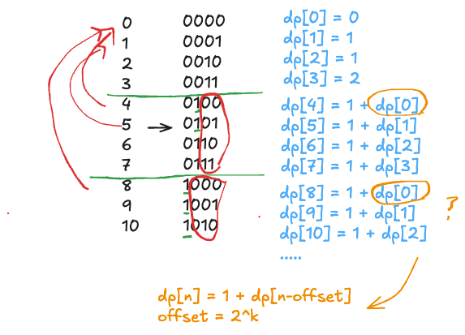

# Leetcode Practice w2
## 前言
這週是 leetcode weekly practice 的第二週, 我們延續上週 [leetcode w1](./leetcode_w1.md) 的模式, 一樣來回顧三道題目, 雖說都是 Easy, 不過滿經典的 bit problem 值得來分享下。那一樣直接進入題目環節。
## 題目

### Missing Number 
Leetcode 第 [268 題](https://leetcode.com/problems/missing-number/description/), 以下為原文:

```txt
Given an array `nums` containing `n` distinct numbers in the range `[0, n]`, return _the only number in the range that is missing from the array.

Example 1:
Input: nums = [3,0,1]
Output: 2
Explanation: n = 3 since there are 3 numbers, so all numbers are in the range [0,3]. 2 is the missing number in the range since it does not appear in nums.

Example 2:
Input: nums = [0,1]
Output: 2
Explanation: n = 2 since there are 2 numbers, so all numbers are in the range [0,2]. 2 is the missing number in the range since it does not appear in nums.

```

題目要求：*input 會給一個大小為 n 的數字 array nums, 其中 array 內的數字範圍為 [0,n] , 例如: n 為 2 時, [0,2] 為 0,1,2 。求 nums 中缺失的那個整數數字。*

這題滿單純的, 用回圈檢查找出哪一個數字不再, 可以事先 sort 過在遍歷 array 一遍, 或是使用 bucket 來儲存計數, 下面提供後者作為參考解。

```JS
function missing_number(nums){
	let size = nums.length;
	let a = new Array(size + 1).fill(0);

	//統計數字結果
	for(let i=0; i<size; i++){
		a[nus[i]]++;
	}

	//找出不存在 nums 中的數字
	for(let i=0; i < a.length; i++){
		if(a[i] == 0)
			return i;
	}

	return;
}
```
利用上參考解就不用先 sort 過一遍, 不過會需要額外的儲存空間,  Time Complexity 為 O(n), Space Complexity 為 O(n) （大小為 nums.length + 1）。

但是是否有方法可以做到不使用額外空間呢? 還真有! 若仔細觀察剛剛提到的的參考解, 利用了 bucket 來儲存計數, 通常使用這招是用空間換取時間, 那換取的是什麼？**是 sorting 的時間** 。而這題其實數字的順序根本不重要, 我們只要找出那個唯一的 missing number 即可。

我們可以分別計算 nums 陣列 & 完美陣列的數字加總在互相減去即可獲得 missing number 這個值
參考解答如下：

```JS
function missing_number(nums){
	let size = nums.length;
	let total_1 = 0;
	let total_2 = 0;

	//加總計算
	for(let i=0; i<size; i++){
		total_1 += nums[i];
	}

	for(let i=0; i < size+1; i++){
		total_2 += i;
	}

	return total_2 -  total_1;
}
```

同樣為 Time: O(n), SpaceL O(1) 還有另外一個解法是使用 Bitwise XOR, 但一般人不太可能自己想到這個解法, 所以就不在這邊分享了, 有興趣的話可以再點[連結](https://github.com/VictorChao996/leetcode/blob/main/268.missing-number/268.missing-number-improve_xor.js)看看參考解。

### Number of 1 Bits
Leetcode 第 [191 題](https://leetcode.com/problems/number-of-1-bits/description/), 以下為原文：
```txt
Given a positive integer n, write a function that returns the number of 
set bits in its binary representation (also known as the Hamming weight).

Example 1:
Input: n = 11
Output: 3
Explanation:
The input binary string 1011 has a total of three set bits.

Example 2:
Input: n = 128
Output: 1
Explanation:
The input binary string 10000000 has a total of one set bit.
```

題目要求： *給一個正整數 n, 求其轉換成二進制後, bit 為 1 的數量加總。*

這題的重點在於不借助 Math 相關的 method 轉換 10 進位為 2 進位的數字, 我們必須自己寫轉換的方法, 以下為參考解:

```JS
function number_of_1_bits(n){
	let total = 0;

	whlie(n > 0){
		if(n % 2 == 1)
			total++;
		n = Math.floor(n/2);
	}

	return total;
}

```

這邊利用短除法求二進制的方法獲取 total, 值得注意的是, 我們不用先轉換成二進制字串後才開始數數, 而是在轉換的過程中就把 total 計算完。 如此一來, 短除法過程走完時, 就已經有 total 結果了。

### Counting Bits
Leetcode 第 [338 題](https://leetcode.com/problems/counting-bits/description/), 以下為原文

```txt
Given an integer `n`, return _an array_ `ans` _of length_ `n + 1` _such that for each_ `i` (`0 <= i <= n`)_,_ `ans[i]` _is the **number of**_ `1`_**'s** in the binary representation of_ `i`.

Example 1:

Input: n = 2
Output: [0,1,1]
Explanation:
0 --> 0
1 --> 1
2 --> 10
Example 2:

Input: n = 5
Output: [0,1,1,2,1,2]
Explanation:
0 --> 0
1 --> 1
2 --> 10
3 --> 11
4 --> 100
5 --> 101

Constraints:
0 <= n <= 105
```

題目要求：*給一個整數 n , 返回一個大小為 n+1 的數字陣列, 其中的每項元素 i (0 <= i <= n) 為 i 轉換成二進制後 bit 1 的數量。*

這一題如果有寫過上面那一道 Number of 1 bits 的問題的話, 那這問題其實可以變成數個 Couting Bits 問題, 可以暴力解如下:

```JS
function Counting_bits(n){
	let result = new Array(n + 1).fill(0);

	for(let i=0; i < result.length; i++){
		result[i] = number_of_1_bits(i);
	}

	return result;
}

function number_of_1_bits(n){
	let total = 0;

	whlie(n > 0){
		if(n % 2 == 1)
			total++;
		n = Math.floor(n/2);
	}

	return total;
}
```


但是接著題目的 follow up ：能否用 O(n) 解就非常有趣了, 肯定有一種方法能夠做到, 關鍵就在於  **linear time ＆ single pass**。
```txt
Follow up:

1. It is very easy to come up with a solution with a runtime of O(n log n). Can you do it in linear time O(n) and possibly in a single pass?

2. Can you do it without using any built-in function (i.e., like __builtin_popcount in C++)?
```

說到 linear time & single pass 就會想到 Dynamic Programming (咦？) , 我們可以找到某一種規律, 例如: 
$$X_n = X_{n-1} + V$$
或是
$$X_n = n + V + X_{n-k}$$
透過把大問題轉換其子問題 + 某些值, 反過來說, 找到這種規律後, 也可以從子問題網上建構出大問題的解 （Bottom Up ）。用文字敘述有一點抽象, 直接來看題目會比較好懂。


把數字轉換成二進制後可以觀察到一個規律是, **每一個區間中數字的 total 為前一個區間的對應數字的 total +1** , 例如: 0 與 4 的差異在 bit 3 為 1, 1 與 5 的差異也是 bit 3 多一個 1。不過這邊有意思的是, 要如何找出上一個區間的對應值呢？ 我們可以觀察到說並不是無腦的 -4 (以 dp[8] 為例, 其解不等於 1 + dp[4] 而是 1 + dp[0]), 那這其中的規律為何？

其實答案就在上圖中, 綠色線段之下的第一個數字極為區間首, 可以當作是這個區間的基準, 該基準就是實際的 offset 值。也就是說, dp[8] 會等於 1 + dp[n-8], 集中 8 就是此區間內所有數字的平移數。

將此公式帶回 dp[1] ~ dp[4] 也同樣符合這樣的規則 (相同區間, 平移數相同), 於是就有了以下參考解：

```JS
function Counting_bits(n){
	let result = new Array(n+1).fill(0);
	let offset = 1;
	
	for(let i=1; i < result.length; i++){

		//當換到下一個區間時, 更新 offset 值 (平移數)
		if(offset * 2 == i)
			offset *= 2;
		result[i] = 1 + result[i - offset]
	}

	return result;
}
```

根據以上的作法, 我們就能夠 bottom up 的建立起 result, 而且也符合 linear time, one pass 的條件, 非常的神奇～

## 結語
本週的這三個題目雖然都是 Easy , 但是題目都滿經典的, 很適合各類人群, 既能滿足新手解題的成就感, 也有各種解法能讓老司機練練手。真的不得不佩服出這個題目的人 & 想得到各種解答的人們, 大家都好厲害(?) 原本這週想偷懶下寫個 Easy 完事, 沒想到有這麼多沒想過的有趣解答, 也算長見識了吧。那本週的挑戰分享就先這樣, 下週繼續~


