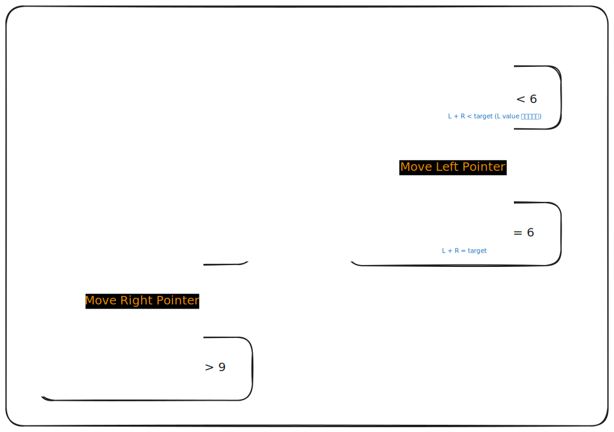
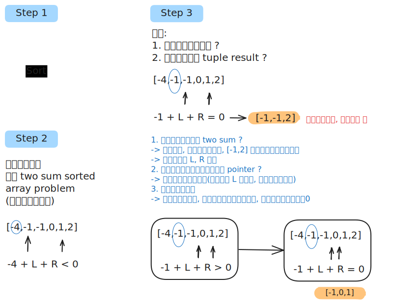

# Leetcode Practice w3

## 前言
本週是 leetcode weekly practice 的第三週, 本週會分享經典題 two sum 以及其相關的延伸題目, 那我們直接進入題目環節。
## 題目
### Two Sum
Leetcode [第 1 題](https://leetcode.com/problems/two-sum/), 以下為原文:

```
Given an array of integers `nums` and an integer `target`, return _indices of the two numbers such that they add up to `target`_.

You may assume that each input would have _exactly_ one solution, and you may not use the _same_ element twice.

You can return the answer in any order.

Example 1:

Input: nums = [2,7,11,15], target = 9
Output: [0,1]
Explanation: Because nums[0] + nums[1] == 9, we return [0, 1].

Constraints:

- `2 <= nums.length <= 104`
- `-109 <= nums[i] <= 109`
- `-109 <= target <= 109`
- Only one valid answer exists.
- 
Follow-up: Can you come up with an algorithm that is less than `O(n2)` time complexity?
```

題目要求：
給一只包含整數數字的陣列 array 與一個整數 target, 返回包含兩個數字的陣列 [a,b] , 其中 a , b 分別代表 array 中兩數和為 target 的 index。題目保證只有唯一解且不會使用相同的 element 兩次 (即 a != b)。

這題最簡單的方法為暴力解, 將所有排列組合列出來即可找到答案, Time Complexity 為 O(n^2), 以下為參考解:

```JS
function twoSum(nums, target){
	let size = nums.length;
	for(let i=0; i < size; i++){
		for(let j=i+1; j < size; j++){
			if(nums[i] + nums[j] == target)
				return [i,j];
		}
	}

	return null;
}
```

這題有個 follow up, 要求用低於 O(n^2) 的 complexity 來解決此問題, 我們可以利用 hash_map 查找其中元素為 O(1) 的特性,  將 complexity 降低為 O(n), 以下為參考解：

```JS
function twoSum(nums, target){
	let size = nums.length;
	let map = new Map();

	for(let i=0; i < size; i++){
		if(map.get(target-nums[i]) != undefined){
			return [i, map.get(target-nums[i])];
		}
		map.set(nums[i], i);
	}
	

}
```

 **利用必定會有解答**這個特性, 我們可以遍歷 array 將 {array[i],i } 存入 map 中, 一邊比對一邊更新 map, 直到與之相加為 target 的解答出現, 因爲 hash map 的特性 (查找為 O(1)), 則此解法可將 Time Complexity 降至 O(n)。

### Two Sum II - Input Array Is Sorted
Leetcode [第 167 題](https://leetcode.com/problems/two-sum-ii-input-array-is-sorted/), 以下為原文

```
Given a **1-indexed** array of integers `numbers` that is already **_sorted in non-decreasing order_**, find two numbers such that they add up to a specific `target` number. Let these two numbers be `numbers[index1]` and `numbers[index2]` where `1 <= index1 < index2 <= numbers.length`.

Return _the indices of the two numbers,_ `index1` _and_ `index2`_, **added by one** as an integer array_ `[index1, index2]` _of length 2._

The tests are generated such that there is **exactly one solution**. You **may not** use the same element twice.

Your solution must use only constant extra space.

Example 1:
Input: numbers = [2,7,11,15], target = 9
Output: [1,2]
Explanation: The sum of 2 and 7 is 9. Therefore, index1 = 1, index2 = 2. We return [1, 2].

Example 2:
Input: numbers = [2,3,4], target = 6
Output: [1,3]
Explanation: The sum of 2 and 4 is 6. Therefore index1 = 1, index2 = 3. We return [1, 3].

Constraints:
- `2 <= numbers.length <= 3 * 104`
- `-1000 <= numbers[i] <= 1000`
- `numbers` is sorted in **non-decreasing order**.
- `-1000 <= target <= 1000`
- The tests are generated such that there is **exactly one solution**.
```

題目要求：
給一個已經 sort 過的 (asc) 的 一維數字陣列, 求和為 target 的位置。

跟上一題 two sum 幾乎一樣的 input & output, 差別在 input array 是 sorted in non-decreasing order。

這題因為 array 是有序的, 且題目保證唯一解, 所以我們可以利用 two pointer, 一前一後慢慢移動 pointer 來找到那個唯一的解答, 參考下方示意圖。



> two sum sorted array 解題示意圖


我們利用 two pointer 的 sum 來判斷要移動 left pointer or right pointer, 當 L + R > target 時, 代表選擇的兩數和過大, 需樣更換數字, 因為 array sorted 的特性, 我們可以知道唯一的選擇為將右指標往左移動, 使得兩數之和變小。同理, 當 L + R < target 時, 我們將左指標往右移動, 使得兩數之和較大。根據以上的規則, 我們可以透過移動左右指標最終找到唯一解, 以下為參考範例。

```JS
function twoSumSorted(nums, target){
	let left=0, right=nums.length-1;

	while(left != right){
		if(nums[left] + nums[right] == target)
			return [left+1, right+1];
		else if(nums[left] + nums[right] > target)
			right--;
		else
			left++;
	}

	return null
}
```

回圈終止條件可以使用 left != right, 因為題目要求不能使用相同的 element, 也代表說, 可以持續移動 left, right pointer 直到兩者相會。根據上面的參考解, 此題的複雜度為 Time Complexity: O(n), Space Complexity: O(1)

這題的解法也可以當作 [Two Sum](#two-sum) 的其中一個參考解, 先將 input array sort 過後, 再利用上述參考解的作法解題, 一樣滿足低於 O(n^2) 複雜的要求。

### Three Sum
Leetcode [第 15 題](https://leetcode.com/problems/3sum/description/), 以下為原文

```
Given an integer array nums, return all the triplets `[nums[i], nums[j], nums[k]]` such that `i != j`, `i != k`, and `j != k`, and `nums[i] + nums[j] + nums[k] == 0`.

Notice that the solution set must not contain duplicate triplets.

Input: nums = [-1,0,1,2,-1,-4]
Output: [[-1,-1,2],[-1,0,1]]
Explanation: 
nums[0] + nums[1] + nums[2] = (-1) + 0 + 1 = 0.
nums[1] + nums[2] + nums[4] = 0 + 1 + (-1) = 0.
nums[0] + nums[3] + nums[4] = (-1) + 2 + (-1) = 0.
The distinct triplets are [-1,0,1] and [-1,-1,2].
Notice that the order of the output and the order of the triplets does not matter.

Example 2:
Input: nums = [0,1,1]
Output: []
Explanation: The only possible triplet does not sum up to 0.

Example 3:
Input: nums = [0,0,0]
Output: [[0,0,0]]
Explanation: The only possible triplet sums up to 0.

Constraints:
- `3 <= nums.length <= 3000`
- `-105 <= nums[i] <= 105`
```

題目要求：
給一個一維數字陣列, **找出所有** ３ 個相加為 0 的組合並放在 array 中返回, 順序沒限制,但**組合不能重複**

這題可以使用 brute force 來求解, 但 time complexity 會是 O(n^3), 並不是一個有效率的做法。我們可以用比較有效率的做法為, **將題目轉換成數個 two sum sorted array 的問題, 最終找出所有的 tuple 組合**。這邊的關鍵點在於移動 L & R pointer 的時候要將**組合不能重複**這個特點考慮進去, 來避免取得重複的 tuple 組合。參考以下示例圖：



> 3 sum 解題示意圖

根據以上的步驟, 我們可以寫出以下的參考解:

```JS
function threeSum(nums){
	const result = [];
	//sort array
	nums.sort((a,b)=> {return a-b;});

	for(let i=0; i < nums.length; i++){
		//若主要數字大於 0, 就不用找了
		if(nums[i] > 0)
			break;
		//若該 iter 的主要數字 & 前一個 iter 的相同則跳過 (避免重複)
		if (i > 0 && nums[i] == nums[i - 1])
			continue;
		let l = i+1, r = nums.length-1;
		//sorted array two sum problem
		while(l < r){
			const sum = nums[i] + nums[l] + nums[r];
			if(sum == 0){
				result.push([nums[i], nums[l], nums[r]]);
				l++;
				//持續移動左指標直到與原 Ｌ 值不相同 (避免重複)
				while(nums[l] === nums[l-1] && l < r){
					l++;
				}
			}else if(sum < 0){
				l++;
			}else{
				r--;
			}
		}
	}

	return result;

}
```

如果曾經寫過 two sum sorted array problem, 應該不難想到此題可以分解為多個該問題, 個人覺得比較困難的點是, 如何適當的移動 Left, Right pointer 使得所有找出的 tuple 組合不會重複, 這是需要仔細想過一遍的。

## 結語
本週從經典題 two sum 開始, 接續分享與 two sum 相關的另外兩題 medium 題目, 其中 1.3 題都是 Blind 75 中滿經典的題目, 就算第一次寫寫不出來, 但思考的過程對鍛鍊頭腦滿有幫助的。此外, 第 2.3 題也是 two pointer 分類中滿經典的題目, 藉由這次練習, 有稍微感受到 two pointer 的魅力了。

那本週的 leetcode 挑戰分享就到這, 下週繼續。