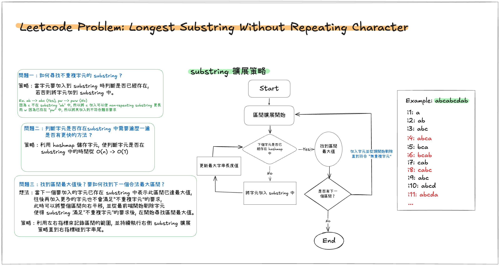
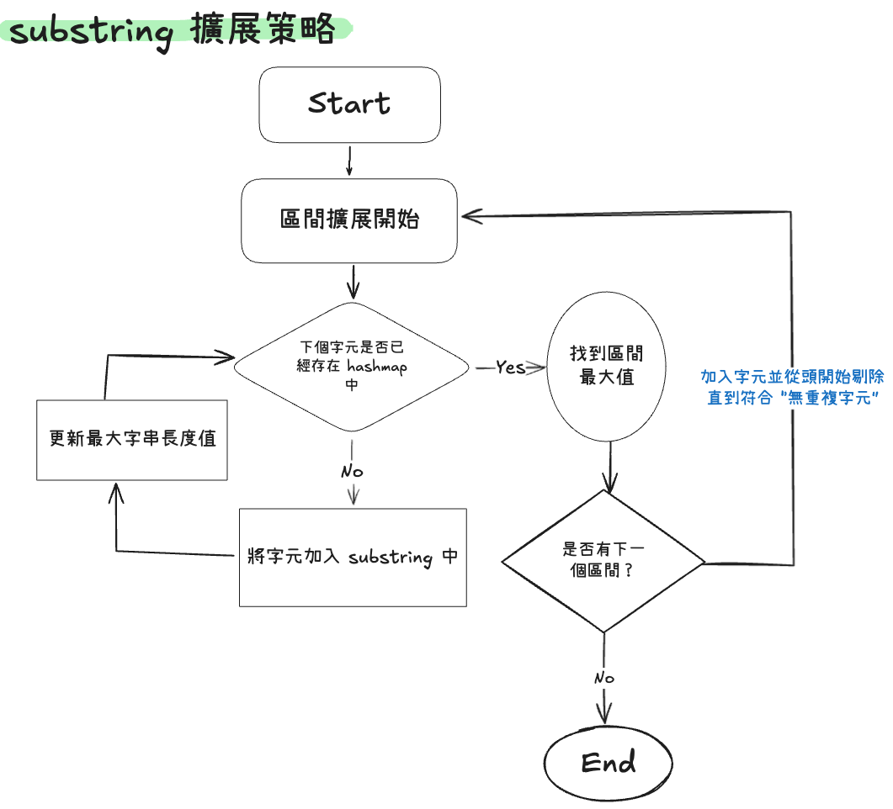

# Leetcode Practice w5

## 前言
最近感到強烈的職業倦怠, 不確定是不是因為工作型態轉換的關係, 感覺不太好。找時間再寫一篇文來記錄下好了, 談談工作型態組成。

本週是 leetcode weekly practice 的第五週, 這次分享的題目總共三題, 其中 3 題都是 Medium , 都與 **two pointer** 或多或少有關, 那我們一樣直接進入題目環節。 

## 題目

### Container With Most Water
Leetcode [第 11 題](https://leetcode.com/problems/container-with-most-water/), 以下為原文：
```
You are given an integer array height of length n. There are n vertical lines drawn such that the two endpoints of the ith line are (i, 0) and (i, height[i]).
Find two lines that together with the x-axis form a container, such that the container contains the most water.
Return the maximum amount of water a container can store.
Notice that you may not slant the container.

Example 1:
Input: height = [1,8,6,2,5,4,8,3,7]
Output: 49
Explanation: The above vertical lines are represented by array [1,8,6,2,5,4,8,3,7]. In this case, the max area of water (blue section) the container can contain is 49.

Example 2:
Input: height = [1,1]
Output: 1
 
Constraints:
n == height.length
2 <= n <= 105
0 <= height[i] <= 104
```
題目要求：
*給一個一為的數字陣列(只包含整數), 其中的數字表示為柱高, 求任意兩柱高所圍成的最大水量。*


這個題目可以用暴力解去比較所有的排列組合最後求出兩柱高所能圍成的最大水量, 以下為參考解。

```JS
function containWithMostWater(height){
	let result = 0;
	for(let i=0; i<height.length; i++){
		for(let j=1+1; j<height.length; j++){
			let containWater = Math.min(height[i,] height[j]) * (j-i);
			if(containWater > result)
				result = containWater;
		}
	}

	return result;
}
```

利用條列出所有可能的排列組合，再一一比較大小, 最後保留最大值即為解答。這麼做雖然直觀, 但是平均 Time Complexity 為 O(n^2), 若陣列大小較大時, 則會跑比較久。

這邊來分享另一種解法, 利用下方的策略, 來減少我們所有檢視的組合, 而不是像暴力解全不組合都掃過一遍。這邊依照兩個策略來選擇：
1. 兩個柱子越遠越好
2. 兩個柱子選擇越高越好

依據以上的策略來選擇較大的 containWater 機會, 我們可以寫出以下參考解：
```JS
function containWithMostWater(height){
	let result = 0;
	let l=0,r=height.length-1;

	while(l < r){
		//計算並更新最大含水量
		const containWater = Math.min(height[l], height[r]) * (r-l);
		if(containWater > result)
			result = containWater;
		//根據策略移動左右指標
		if(height[l] < height[r]){
			l++;
		}else{
			r--;
		}
	}

	return result;
}
```
這邊分別用兩個 pointer l (left), r (right) 來指向兩個所選擇的柱子, 根據策略一, 我們讓兩柱子分別從第一個 & 最後一個柱子開始計算, 並逐漸向中心移動。**而根據策略二, 我們選擇移動較低的柱子 a, 因其移動至的下一個位置比原位置柱 a 高的機率會比另一個較高的柱子 b 移動來的大**。 

最終這個選擇柱子的策略會持續進行到兩柱重合才結束, 根據以上的參考解可知, 此解的平均 Time Complexity 只有 O(n), 比起暴力解來的快很多。

### Longest Substring Without Repeating Characters
Leetcode [第 3 題](https://leetcode.com/problems/longest-substring-without-repeating-characters/), 以下為原文：
```
Given a string s, find the length of the longest substring without repeating characters.

Example 1:
Input: s = "abcabcbb"
Output: 3
Explanation: The answer is "abc", with the length of 3.

Example 2:
Input: s = "bbbbb"
Output: 1
Explanation: The answer is "b", with the length of 1.

Example 3:
Input: s = "pwwkew"
Output: 3
Explanation: The answer is "wke", with the length of 3.
Notice that the answer must be a substring, "pwke" is a subsequence and not a substring.
 
Constraints:
0 <= s.length <= 5 * 104
s consists of English letters, digits, symbols and spaces.
```
題目要求：
*input 一個字串, 求字串中最長不重複字元的子字串的長度*。

與上一題類似, 這題仍可以使用暴力法去尋找所有的組合 (substring) 並判斷是否為不重複字元, 但這樣的做法 Time Complexity 較高, 不是很理想。說到組合, 這題的優化也是類似使用 two pointer 的做法, 來避免檢查太多不必要的組合。以下為思考過程：


> 思考策略圖

需要思考的點不少:
1. 如何尋找不重複字元的 substring ?
2. 判斷字元是否存 substring 中有沒有比遍歷一遍 substring 更快的方法 ?
3. 找到第一個最長的不重複子字串後 ?

這邊我們讓兩個 left, right pointer 分別代表區間的邊界, 而這之中就是符合 “無重複字元” 的 substring。透過 pointer 的移動, 判斷 “加入新的字元是否使得 substring 字元不重複” 這點, 可以利用 hashmap 來讓查找的時間從 O(n) -> O(1), 減少判斷上的 time complexity。

這邊比較難的點是, 找到第一組最大非重複字元 substring 後呢？**要如何移動整個邊界？** right pointer 的移動策略是已知的 (持續向右擴展區間保證長度最大), 那 left pointer 呢？

參考上面的思考策略圖, **當找到區間最大值時 (概念上), 此時加入的下一個字元會使得子字串字元 repeat, 於是應從頭開始剔除字元直到子字串符合 "無重複字元"** 。如何將字元從區間 "剔除" ？其實就是移動我們的 left pointer, 直至條件滿足, 在此流程下, left, right pointer 所圍成的**區間**就像是在移動。*ps. 所以這題才會歸類在 sliding window*

我們來看看參考解：
```JS
function LongestSubstringWithoutRepeatingCharacter(s){
	if(s.length == 1 || s.length == 0)
		return s.length;
	
	let l=0, r=0, maxLen=0;
	const m = new Map();
	while(r < s.length){
		//移動 left pointer 使得區間條件滿足
		while(m.get(s[r])){
			m.set(s[l], null);
			l++;
		}
		m.set(s[r], 1);
		
		//更新 maxLen(注：判斷前區間的條件已滿足)
		if(r-l+1 > maxLen)
			maxLen = r-l+1;
		r++;
	}

}
```
從參考解中可看到, 根據 substring 的擴展策略直到 r 碰到最尾端 (亦即沒有下一個區間) 為止, 最終得到解答。此解的平均 Time Complexity 為 O(n), Space Complexity 也為 O(n), 比起暴力解尋找所有 substring 組合的方式來的省時。

### Longest Repeating Character Replacement
Leetcode [第 424 題](https://leetcode.com/problems/longest-repeating-character-replacement/), 以下為原文：
```
You are given a string s and an integer k. You can choose any character of the string and change it to any other uppercase English character. You can perform this operation at most k times.

Return the length of the longest substring containing the same letter you can get after performing the above operations.

Example 1:
Input: s = "ABAB", k = 2
Output: 4
Explanation: Replace the two 'A's with two 'B's or vice versa.

Example 2:
Input: s = "AABABBA", k = 1
Output: 4
Explanation: Replace the one 'A' in the middle with 'B' and form "AABBBBA".
The substring "BBBB" has the longest repeating letters, which is 4.
There may exists other ways to achieve this answer too.
 
Constraints:
1 <= s.length <= 105
s consists of only uppercase English letters.
0 <= k <= s.length
```

題目要求：
*給一個  input 字串 s, 與一個整數 k , 其中 k 表示可以用任意字元替換 s 中單一字元的次數, 求 s 經過最多 K 次操作後, 所能包含的最大 “相同字元子字串”。例：S = AAAABA, k=2, 此時  result 為 6 (B 可替換成 Ａ)* 

這題個人覺得滿難的, 在沒有提示的情況下, 要獨自想出來真的不容易, 但既然是 Blind 75 的題目, 還是必須好好弄懂它。這題主要概念與上一題類似, 又是要尋找特定的 substring 組合, 不過條件換成最長的相同字元, 遇到關鍵字: **一維陣列, 尋找所有排列組合** 就會讓人聯想到 two pointer 或 sliding window (咦？) 來避免暴力解的方式來尋找所有可能的組合。

不過這題最難的關鍵還是在於, 我們在尋找怎樣的 substring ？像上一題為找出 "不重複字元" 的字元, 而此題的滿足條件到底是什麼？

我們知道, 當 substring 中需要被替換的字元數小於 K 時, 這樣的 substring 會滿足條件。 而哪些字元要被替換？字串中出現頻率較低的字元應該要被替換, 因為這樣有較高的機率讓相同字元的字串長度最大。換個角度來看, **字串中出現頻率最高的字元出現次數(a) + 總替換數 = substringLength (L)**, 而只要這個**總替換數 <= K** 就代表這個 substring 符合我們要找的條件。根據數學運算, 我們可以得到以下公式:
$L - a <= K$

所以我們區間的條件就是要滿足上述提到的公式, 那剩下的就是依照左右指標的移動, 盡可能的去尋找最大的區間長度了~ 

以下為參考解：
```JS
var characterReplacement = function (s, k) {
	let l = 0,
		r = 0,
		maxLen = 0;
	const array = new Array(26).fill(0);
	while (r < s.length) {
		array[s[r].charCodeAt(0) - "A".charCodeAt(0)]++;

		//若區間條件不符合, 則移動左指標
		if (r - l + 1 - maxCharAmount(array) > k) {
			array[s[l].charCodeAt(0) - "A".charCodeAt(0)]--;
			l++;
			//上面多統計的要先扣掉,才不會在 continue 多算到
			array[s[r].charCodeAt(0) - "A".charCodeAt(0)]--;
			continue;
		}

		//更新 maxLen 值
		if (r - l + 1 > maxLen) maxLen = r - l + 1;
		r++;
	}
	return maxLen;
};

//找區間內出現頻率最高的字母數量
let maxCharAmount = function (array) {
	let result = 0;
	for (let i = 0; i < 26; i++) {
		if (array[i] > result) result = array[i];
	}
	return result;
};
```

與上一題程式碼結構類似, right pointer 持續移動擴展區間, 而 left pointer 則在區間條件不滿足的情況下向右移動, 在此過程中, 只有符合區間條件者, 才去計算並更新最大值, 最終返回 result。

要注意的是：上述參考解使用到 continue **會使得下一個 iteration 的 array 的統計 & 區間 size 不一致**, 所以要記得先扣掉多餘的統計, 或是像是下面另一個參考解, 直接使用 while 從而避免使用 continue：

```JS
var characterReplacement = function (s, k) {
	let l = 0,
		maxLen = 0;
	const array = new Array(26).fill(0);
	for (let r = 0; r < s.length; r++) {
		array[s[r].charCodeAt(0) - "A".charCodeAt(0)]++;

		//若區間條件不符合, 則移動左指標
		while (r - l + 1 - maxCharAmount(array) > k) {
			array[s[l].charCodeAt(0) - "A".charCodeAt(0)]--;
			l++;
		}

		//更新 maxLen 值
		if (r - l + 1 > maxLen) maxLen = r - l + 1;
	}
	return maxLen;
};

let maxCharAmount = function (array) {
	let result = 0;
	//找區間內出現頻率最高的字母數量
	for (let i = 0; i < 26; i++) {
		if (array[i] > result) result = array[i];
	}
	return result;
};
```

上面兩個參考解的概念相同, 但實作方式有差異。而這兩者的平均 **Time Complexity 為 O(n * 26)** (n 為 s 的大小, 26 為查詢 maxCharAmount 的複雜度) => O(n), **Space Complexity 則為 O(m)**, 其中 m 為字串可包含之相異字元數 (在本題中為大寫英文字母, 共２６個)。

## 結語
本週分享了三題 two pointer 相關題目, 其中後兩題又被歸類為 **sliding window**, 寫完了這兩題有感受到 sliding window 的核心概念：**以 two pointer 所要解決的問題（減少暴力解找出所有組合的時間複雜度較高) 外, 再加上依據條件判斷 left,right pointer 構成的區間是否合法**。這概念不難理解, 我覺得較難的有兩點：
1. 找出區間符合的條件 (題目實際上在尋找什麼？)
2. 區間移動的條件 (如何移動你的左右指標？)

找出以上的兩點, 便可依據類似第二題的流程圖 (如下圖)的架構寫出主幹, 最後再補上邊界處理了, 就能獲得解答。


以上就是本週 leetcode 挑戰所分享的三個題目了, 那先到這, 下週繼續努力～