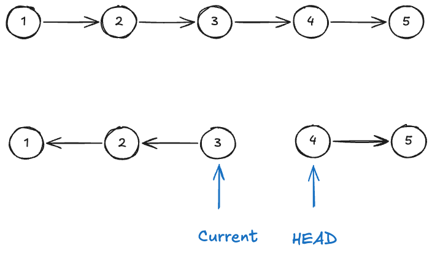
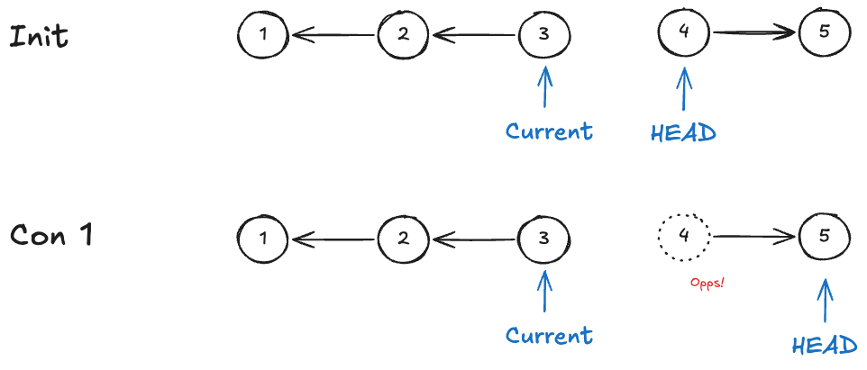
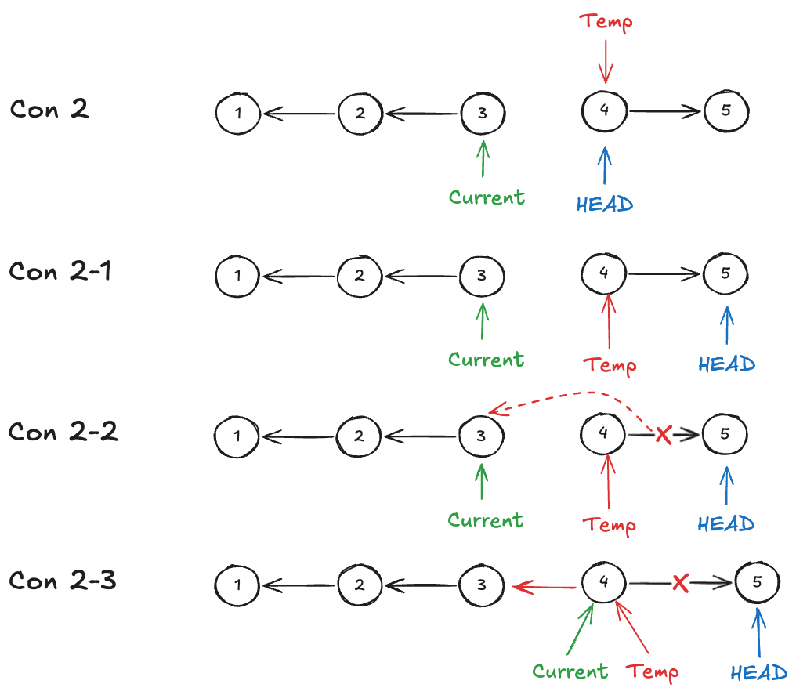
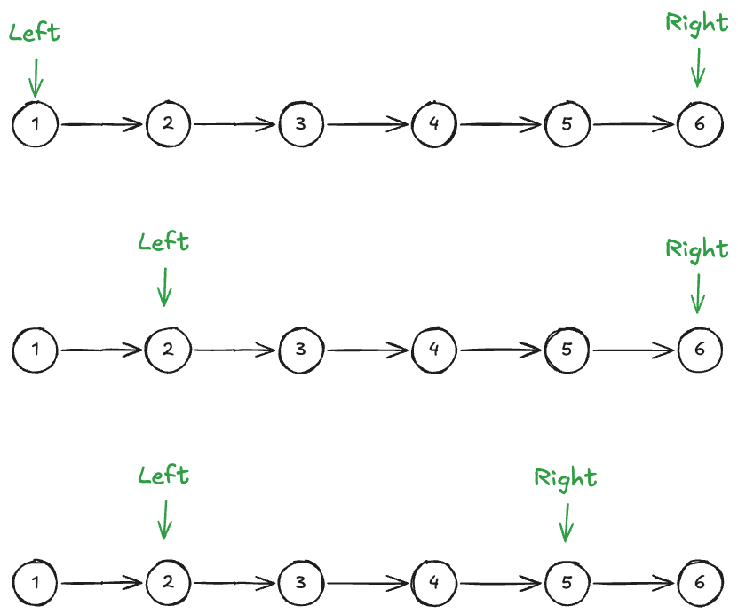
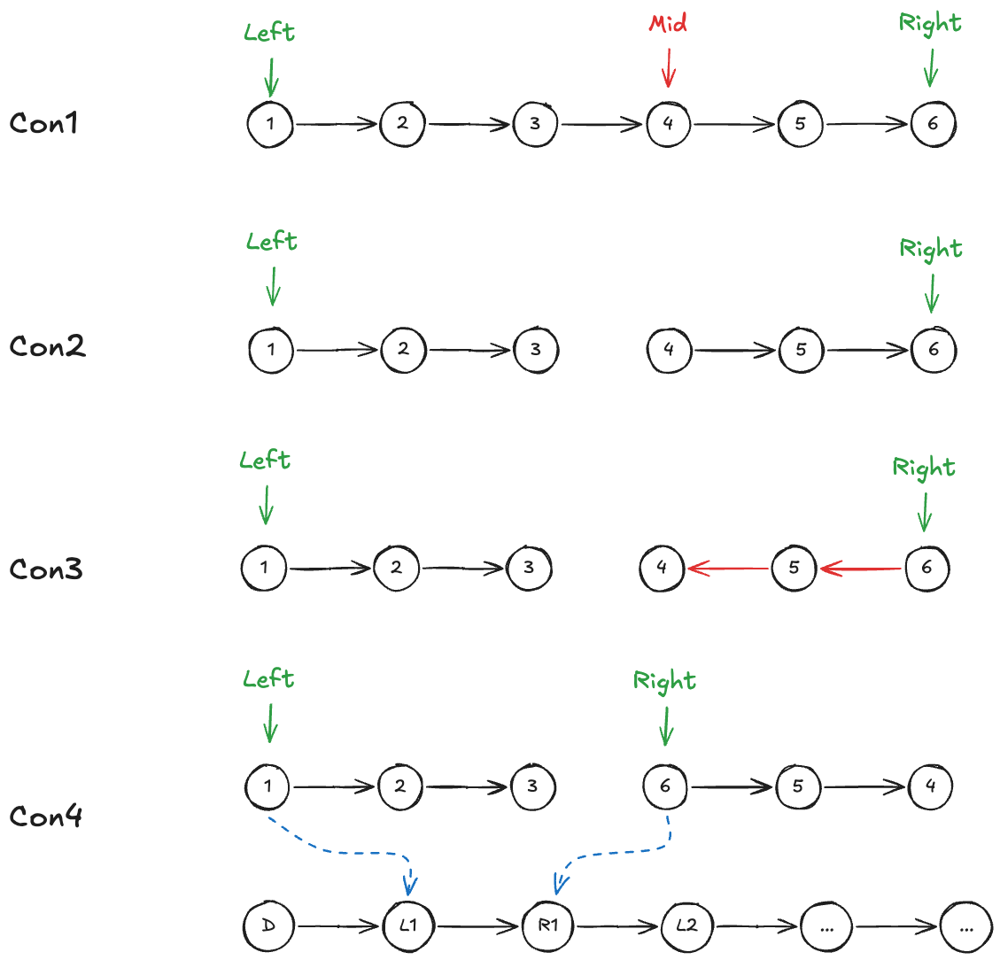

# Leetcode Practice w6

## 前言
本週是 leetcode weekly practice 的第6週, 本週會有 3+1 題, 其中三題 Easy, 一題 Medium, 都是 Linked List 的經典題目, 值得一寫。

### 關鍵思考點
Linked List 題目有幾點需要先弄懂：
1. 如何遍歷 Linked List?
2. 這個 node 是否指向任何東西？是否為任一 list 的 head ?
3. 將 head 移往下一個 node 的時候, 需不需要注意什麼？

基本上解題的過程只要這三個問題有明確的想法, 再加上解題策略, 都能順利的完成題目。那我們一樣直接來看題目。

## 題目

### 1 - Merge Two Sorted Lists
Leetcode [第 21 題](https://leetcode.com/problems/merge-two-sorted-lists/), 以下為原文：
```
You are given the heads of two sorted linked lists `list1` and `list2`.

Merge the two lists into one **sorted** list. The list should be made by splicing together the nodes of the first two lists.

Return _the head of the merged linked list_.

Example 1:
Input: list1 = [1,2,4], list2 = [1,3,4]
Output: [1,1,2,3,4,4]

Example 2:
Input: list1 = [], list2 = []
Output: []

Example 3:
Input: list1 = [], list2 = [0]
Output: [0]
 

Constraints:
The number of nodes in both lists is in the range [0, 50].
-100 <= Node.val <= 100
Both list1 and list2 are sorted in non-decreasing order.

```


> example 1 示意圖 (resource: leetcode)

題目要求：
*給兩個 Linked List 的 head (node), 其中這兩個 Linked List 中 node 的 value 是由小到大排序, 返回兩個 list 合併之後的結果 (須維持由小到大的排序限制)*

這題是基礎中的基礎, 概念不難, 只要一一比較當前 head 的值, 並將較小者優先接到新的 Linked List 上即可, 有點 two pointer 題目的味道。個人認為此題的重點是在熟悉 Linked List 的概念,  Linked List 的操作畢竟跟 array 的遍歷有很大的不同, 要處理 **pointer** 的指向, 很容易頭昏 : D 

以下為參考解：
```JS
function mergeTwoLists(list1, list2){
	let head = new ListNode();
	let current = head;

	while(list1 && list2){
		if(list1.val < list2.val){
			current.next = new ListNode(list1.val, null);
			list1 = list1.next;
		}else{
			current.next = new ListNode(list2.val, null);
			list2 = list2.next;
		}
		current = current.next
	}

	if(list1){
		current.next = list1;
	}else{
		current.next = list2;
	}

	return head.next;
}
```
上面參考解就如剛剛所說的, 當 list1 & list2 （此處用作遍歷的 node）尚未碰到底時, 兩倆互相比較, 較小者會優先接在 current 之後。而等到其中一個 list 結束時, 另一個 list 便可整串直接接在 current 後。

上述的遍歷比較過程並不是使用原本 input 的 list node, 而是直接 new 一個 `ListNode()`, 因此此題的 Space Complexity 為 O(n）。若熟悉 Linked List 的概念, 以正確的順序設定 list node, 便可利用 input 提供的 list node 得到相同的 result 。

```JS
function mergeTwoLists(list1, list2){
	let head = new ListNode();
	let current = head;

	while (list1 && list2) {
		if (list1.val > list2.val) {
			current.next = list2;
			list2 = list2.next;
		} else {
			current.next = list1;
			list1 = list1.next;
		}
		current = current.next;
	}

	if (list1) {
		current.next = list1;
	}
	if (list2) {
		current.next = list2;
	}
	return head.next;
}
```
上面的參考解就巧妙的利用已經存在的 node 來建立新的 Linked List,  所以 Space Complexity 為 O(1)。

### 2 - Reverse Linked List
Leetcode [第 206 題](https://leetcode.com/problems/reverse-linked-list/), 以下為原文：
```
Given the `head` of a singly linked list, reverse the list, and return _the reversed list_.

Example 1:
Input: head = [1,2,3,4,5]
Output: [5,4,3,2,1]

Example 2:
Input: head = [1,2]
Output: [2,1]

Example 3:
Input: head = []
Output: []

Constraints:
The number of nodes in the list is the range [0, 5000].
-5000 <= Node.val <= 5000
 
Follow up: A linked list can be reversed either iteratively or recursively. Could you implement both?
```

> example 1 示意圖 (resource: leetcode)

題目要求：
*給一個 Linked List 的 head, 要求將整個 Linked List 反轉後回傳新 List 的 Head*

此題有好幾種解法, 先來分享一個最容易想到的, 以下為參考解：
```JS
function reverseList(head){
	const array = new Array();
	let temp, dummy = new ListNode();
	temp = dummy;

	while(head){
		array.push(head.val);
		head = head.next;
	}
	
	for(let i=array.length-1; i >= 0; i--){
		temp.next = new ListNode(array[i]);
		temp = temp.next;
	}
	return dummy.next;
}
```
上面的參考解簡單暴力, 先走完一遍 Linked List, 並在過程中將 node 的 value 存在 array 中, 最後在從 array 尾往回建立新的 Linked List 即為解答。這思路簡單明瞭, 但是會使用到額外的空間來存 node value, 因此平均 Space Complexity 為 O(n).

有沒有做法能夠使 Space Complexity 為 O(1) 呢？ 還真有 !  只要一邊遍歷 Linked List 一遍反轉整個 Linked List 即可, 以下為參考解：
```JS
function reverseList(head){
	let current=null, temp=null;

	while(head){
		temp = head;
		head = head.next;
		temp.next = current;
		current = temp;
	}

	return current;
}
```
從以上參考解可以看出, Time Complexity 為 O(n), 而 Space Complexity 為 O(1), 只用額外的兩個變數來暫存, 與 list 長度無關。以上解答看似非常簡潔明瞭, 但是要如何一邊遍歷 Linked List 又反轉？ 關鍵又回到文章開頭提到的三個關鍵問題：

1. 如何遍歷 Linked List?
2. 這個 node 是否指向任何東西？是否為任一 list 的 head ?
3. 將 head 移往下一個 node 的時候, 需不需要注意什麼？





因為 Linked List 的單向性, 我們可以推斷在遍歷 Linked List 的過程中, 勢必有額外的變數來指向反轉後 list 頭, 這邊姑且叫他 current 。下一個問題, 要如何適當的移動這兩個 Linked List head 至下一個位置？若直接移動 HEAD 會導致 node "4" 被遺忘, 使其再也無法被找到。

依此情況, 我們必須再用另一個變數 temp 指向 node "4" 的位置, 再移動我們的 HEAD, 接著再將 temp 的 next 從原先的指向下一個 node 改成指向前一個 node （也就是當前的 current 指向的 node), 最終完成 完成 node "4" 的反轉。

參考下方示意圖中的重複步驟 1~4 直到 HEAD 為 null 時, 代表整個 Linked List 反轉完畢, 此時 current 即為原始 Linked List 完整反轉後的頭, 也是此題的 return 值。




若是第一次接觸此題的人, 真的需要認真琢磨一番, 畢竟每一個指摽的移動, 都代表者要重新思考開頭提及的 [關鍵思考點](#關鍵思考點) , 每增加一個變數紀錄 node 都是對大腦的負擔～

By the way, 題目 follow up 要求使用 iteratively & recursively 解決此問題, 所以這邊也來分享後者的解法：

```JS
function reverseList(head){
	if(!head)
		return null;
	let newHead = head;

	if(head.next){
		newHead = reverseList(head.next)
		head.next.next = head
	}
	head.next = null;

	return newHead;
}
```
個人覺得這比 iterative 還難理解 XD, 能摸索出這個解法的真的是大神, 此題就懶得畫圖解了, 概念就是將原先的問題拆成子問題, 並找出構建最小單位的邏輯 (在這邊為：len 0, len 1, len 2 的 Linked List), 最後便能得出解答。  

### 3 - Reorder List
Leetcode [第 143 題](https://leetcode.com/problems/reorder-list/description/), 以下為原文：
```
You are given the head of a singly linked-list. The list can be represented as:

L0 → L1 → … → Ln - 1 → Ln

_Reorder the list to be on the following form:_

L0 → Ln → L1 → Ln - 1 → L2 → Ln - 2 → …

You may not modify the values in the list's nodes. Only nodes themselves may be changed.

Example 1:
Input: head = [1,2,3,4]
Output: [1,4,2,3]

Example 2:
Input: head = [1,2,3,4,5]
Output: [1,5,2,4,3]
 
Constraints:
The number of nodes in the list is in the range [1, 5 * 104].
1 <= Node.val <= 1000
```

> example 1


> example 2

題目要求：

*給一個 linked list 的 head, 根據題目規則重新排序整個 Linked List, 題目限制不能更改 node 本身的值, 只能更改 node 本身。其中的規則為, 原先的 list L0 → L1 → … → Ln - 1 → Ln, 會重新排序為 L0 → Ln → L1 → Ln - 1 → L2 → Ln - 2 → .*


在分享此題的解法之前要先來介紹另一題, 因為跟此題的解法有相關。
#### 3-1 Middle of the Linked List
Leetcode [第 876 題](https://leetcode.com/problems/middle-of-the-linked-list/), 以下為原文：
```
Given the head of a singly linked list, return the middle node of the linked list.
If there are two middle nodes, return the second middle node.

Example 1:
Input: head = [1,2,3,4,5]
Output: [3,4,5]
Explanation: The middle node of the list is node 3.

Example 2:
Input: head = [1,2,3,4,5,6]
Output: [4,5,6]
Explanation: Since the list has two middle nodes with values 3 and 4, we return the second one.

Constraints:
The number of nodes in the list is in the range [1, 100].
1 <= Node.val <= 100
```

> example 1


> example 2


題目要求：
*給一個 Linked List 的 head, 返回此 linked list 的中間 node, 若 node 總數為偶數, 則返回中間兩
 node 的後者。*

此題的解法, 我們利用兩個指標, **一個快指標一次走兩格, 另一個慢指標一次走一格**, 當快指標走到底時, 慢指標指向的 node 即為 Linked List 的中間。

以下為參考解：
```JS
function middleOfLinkList(head){
	let slow = head, fast = head;

	while(fast && fast.next){
		slow = slow.next;
		fast = fast.next.next;
	}
	return slow;
}
```

#### 回到原題
敏銳的讀者應該已經能夠察覺, 題目的規則類似 two pointer 題目一左一右依序往中間靠攏。


但問題是, Linked List 是單向的, 右指標要如何移動？node "5" 要如何指向 node "4" ? 參考下方示意圖, 只要將其反轉即可, 反轉後指向 node "5" 的 “右指標” 自然下一個要指向的位置即為 list 的下一個 node, 也就是 node "4"。


而從哪個 node 開始反轉 list 呢？其實就是整個 linked list 的中心點（Mid node） 開始, 而尋找 Mid 的方法就依 [[#3-1 Middle of the Linked List]] 中分享的方式。細心觀察就會發現,在經過轉換後, 此題變成兩個 list 的 merge 問題了（con4）, 類似 [1 - Merge Two Sorted Lists](#1---merge-two-sorted-lists) 但是不用判斷大小的版本。

以下為參考解：
```JS
function reorderList(head){
	if(!head.next) return head;
	let temp1, temp2, temp3, temp4, temp5;
	let midHead = findMidHead(head);
	let newMidHead = reverseList(head);

	temp1 = head;
	while(temp1.next && temp1.next != midHead){
		temp1 = temp1.next;
	}	
	temp1.next = null //切斷 Linked List, 只保留前一個部分

	temp2 = head;
	temp3 = newMidHead;
	temp4 = new ListNode(0); //dummy node
	temp5 = temp4

	//merge two list with new order
	while(temp2 && temp3){
		let c1 = temp2.next;
		let c2 = temp3.next;

		temp2.next = null;
		temp5.next = temp2;
		temp3.next = null;
		temp5.next.next = temp3;

		temp2 = c1;
		temp3 = c2;
		temp5 = temp5.next.next;
	}
	if(temp2){
		temp5.next = temp2;
	}else{
		temp5.next = temp3;
	}

	//註：同等於 head = temp4.next, 但不知為何此題不能直接 override head 的值, 所以必須要這樣寫
	head.next = temp4.next.next
	
}

function reverseList(head){
	let current = null, temp = null

	while(head){
		temp = head;
		head = head.next
		temp.next = current;
		current = temp;
	}
	return current;
}

function findMidHead(head){
	let slow=head, fast=head;

	while(fast && fast.next){
		slow = slow.next;
		fast = fast.next;
	}
	return slow;
}
```
以上的參考解 Time Complexity 為 O(n), Space Complexity 為 O(1), 使用這個 tricky 的解法, 既可以不使用額外的空間暫存 (如：array), 也能在 O(n) 的時間複雜度內解, 非常的神奇。


## 結語
不知不覺已經到第六週了呢, 沒想到已經分享了 18 +1 個 Leetcode 題了, 雖然 Easy 題佔多數 (~~快被我寫完了, 怕~~), 但從 Blind 75 下手而不是讓 leetcode 隨機出題果然是對的。有深刻的感覺到這些真的是基礎中的基礎, 即便是 Easy 題目, 這些不同的解法仍能強化我對相似概念的基礎知識。

老實說目前分享的題目有不少都是大學時就寫過的, 有印象, 相對來說會比較容易寫, 等到我把看過的題目都寫完後, 才是真正的開始。 期待之後我仍能每週發文, 順利完成 [2024 年尾的 6 個月個人 & 職涯目標](../2024_6_month_goal.md) 中的 leetcode 目標, 那本週的分享就先到這, 下週繼續。