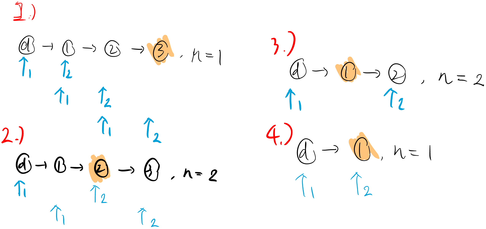

# Leetcode Practice w7
## 前言
本週是 leetcode weekly practice 的第七週, 

總共三題, 其中 1 題 Easy , 1 題 Medium, 1 題 Hard, 與上週相同, 都是 Linked List 類型的題目, 那我們一樣直接進入題目環節。 

## 題目

###  1 - Linked List Cycle
Leetcode [第 141 題](https://leetcode.com/problems/linked-list-cycle/), 以下為原文：
```
Given head, the head of a linked list, determine if the linked list has a cycle in it.

There is a cycle in a linked list if there is some node in the list that can be reached again by continuously following the next pointer. Internally, pos is used to denote the index of the node that tail's next pointer is connected to. Note that pos is not passed as a parameter.

Return true if there is a cycle in the linked list. Otherwise, return false.

Example 1:
Input: head = [3,2,0,-4], pos = 1
Output: true
Explanation: There is a cycle in the linked list, where the tail connects to the 1st node (0-indexed).

Example 2:
Input: head = [1,2], pos = 0
Output: true
Explanation: There is a cycle in the linked list, where the tail connects to the 0th node.

Example 3:
Input: head = [1], pos = -1
Output: false
Explanation: There is no cycle in the linked list.
 
Constraints:
The number of the nodes in the list is in the range [0, 104].
-105 <= Node.val <= 105
pos is -1 or a valid index in the linked-list.
 
Follow up: Can you solve it using O(1) (i.e. constant) memory?
```
題目要求：
*給一個  Linked List head, 判斷該 linked list 的尾端, 是否又指向之前的 node, 此時整個 linked list 形成一個 cycle, 有 cycle 回傳 true, 反之則回 false*

此題比較直覺的作法為, 一邊遍歷 linked list 一邊將 node 存入 hashmap 中, 當有 cycle 時, list 尾端的 “下一個 node” 會為已經存在 hashmap 的 node, 反之, 尾端的 "下一個 node " 為 null。（類似題目：contain duplicate 題目中的檢查） 不過使用 hashmap 的作法需要會使得 Space Complexity 為 O(n) , 大小與 linked list 長度相同。

以下提供一個有趣的解法, 我們使用兩個指標, 一個快一個慢。**概念就類似 "倒追", 在田徑長跑比賽中, 跑得較快的跑者是有機會比較慢的跑者多跑一圈, 形成前者 “追上” 後者的狀況**。而快慢指標就是用這個概念, 當 linked list 具有 cycle 時, 無論這個圈有多大, 只要跑者能等速持續跑下去, 腳程較快者一定能夠倒追較慢者。以下為參考解：

```JS
function linkedListCycle(head){
	if(!head || !head.next)
		return false;

	let fast = head, slow = head;

	while(fast){
		head = head?.next?.next;
		slow = slow?.next

		if(head == slow)
			return true;
	}

	return false;
	
}
```
上述參考解中, 我們讓快指標一次走兩步, 而慢指標一次走一步, fast 持續走直到追上 slow 或沒有下一步可走時便能判斷此 input linked list 是否具有 cycle。利用這個概念, 我們便能在 Time Complexity: O(n), Space Complexity: O(1) 下得到此題的解答。


### 2 -  Remove Nth Node From End of List
Leetcode [第 19 題](https://leetcode.com/problems/remove-nth-node-from-end-of-list/), 以下為原文：
```
Given the head of a linked list, remove the nth node from the end of the list and return its head.

Example 1:
Input: head = [1,2,3,4,5], n = 2
Output: [1,2,3,5]

Example 2:
Input: head = [1], n = 1
Output: []

Example 3:
Input: head = [1,2], n = 1
Output: [1]
 
Constraints:
The number of nodes in the list is sz.
1 <= sz <= 30
0 <= Node.val <= 100
1 <= n <= sz
```
題目要求：
*給一個 linked list head 與 數字 n, 返回移除倒數第 n 個 node 之後的新 linked list*

看到這題的當下第一個浮現的想法為, 先遍歷一次 linked list 得知整體 list 長度後, 再換算需要移除的 node 為從頭數來的第幾個, 來看一下參考解：

```JS
function removeNthNode(head, n){
	let temp = head, dummy = new ListNode(),len = 0;
	while(temp){
		temp++;
		temp = temp.next;
	}
	dummy.next = head;
	temp = dummy;
	for(let i=0; i<(len-n); i++){
		temp = temp.next;
	}
	temp.next = temp.next.next;

	return dummy.next;
}
```

上述參考解的平均 Time Complexity 為 O(n), Space Complexity 則為 O(1), 但需要遍歷兩次 linked list, 是否能夠只遍歷一次 (one pass) 就得到解答呢？其實可以！

我們可以利用 two pointer 分別指向兩個位置, 一個指向要移除的 node （first）, 另一個指向最後一個 node 的下一個位置 (second), 其中這兩個 pointer 之間差了 n 步。**將兩個指標同時向前平移一步, 此時 second 指標的位置會在 list 尾, 而 first 指標則會在要移除的 node 的前個位置**。

這兩個 pointer 之間差了 n 步, 無論往前平移多少, 都會差 n 步。我們可以這樣理解, **開局先讓 second 指標走 n 步後, first 指標才開始使跟著移動, 此時兩個指標正好差 n 步**, 接者就能夠一起移動直到 second 指標碰到尾時, 變能找到要 remove 的 node 了, 來看下方示意圖。


這邊最關鍵的點在於, 把兩個指標的距離給轉換成 "先讓 second 指標走 n 步" 是需要想一下, 這個想法畢竟沒有很直覺。不過想通之後, 滿簡單的就能實作出這題的, 以下為參考解:

```JS
function removeNthNode(head, n){
	let dummy = new ListNode(), first, second;
	dummy.next = head;
	first = dummy;
	second = dummy;

	//先讓 second 指標走 n 步
	for(let i=0; i < n; i++){
		second = second.next;
	}

	while(second.next){
		first = first.next;
		second = second.next;
	}
	first.next = first.next.next; //移除 node
	
	return dummy.next;
}
```
上述參考解的平均 Time Complexity 為 O(n), Space Complexity 為 O(1), 只需要遍歷一次 linked list （one pass）變能夠獲得解答, 比上一個參考解來的好一點。


### 3 - Merge k Sorted Lists
Leetcode [第 23 題](https://leetcode.com/problems/merge-k-sorted-lists/), 以下為原文：
```
You are given an array of k linked-lists lists, each linked-list is sorted in ascending order.
Merge all the linked-lists into one sorted linked-list and return it.

Example 1:
Input: lists = [[1,4,5],[1,3,4],[2,6]]
Output: [1,1,2,3,4,4,5,6]
Explanation: The linked-lists are:
[
  1->4->5,
  1->3->4,
  2->6
]
merging them into one sorted list:
1->1->2->3->4->4->5->6

Example 2:
Input: lists = []
Output: []

Example 3:
Input: lists = [[]]
Output: []
 
Constraints:
k == lists.length
0 <= k <= 104
0 <= lists[i].length <= 500
-104 <= lists[i][j] <= 104
lists[i] is sorted in ascending order.
The sum of lists[i].length will not exceed 104.
```
題目要求：
*給一個 array lists 其中為數個 sorted linked list 的 head （linked list 中的 node 值由小到大排序）, 將所有 linked list 合併成一個新的 sorted linked list 後返回*

這題是我目前寫下來覺得最簡單的 Hard 題目 （~~好像也沒寫過幾題？~~）, 印象中 hard 題目應該都是看完題目後沒有什麼頭緒, 但此題的暴力解比想像中的還簡單。

我們可以先掃過所有的 node 並將 value 存在 array 中, 接者 sort 過後再依據新的排序建立 linked list 即為解答, 以下為參考解：

```JS
function mergeKSortedLists(lists){
	const a = new Array();
	let temp, dummy = new ListNode();

	//store node value in array
	for(let i=0; i<lists.length; i++){
		temp = lists[i];
		while(temp){
			a.push(temp.val);
			temp = temp.next;
		}
	}
	//sort array value in asc
	a.sort((a,b)=>{
		return a-b;
	})
	//build new sorted linked list
	temp = dummy;
	for(let i=0; i<a.length; i++){
		temp.next = new ListNode(a[i]);
		temp = temp.next;
	}

	return dummy.next;
}
```
上述解法的簡單暴力好理解, 但平均 Time Complexity 為 O(nlogn),  Space Complexity 則為 O(n), 其中 n 為全部 node 的總數量。

還有另一個更好的解法, 如果有寫過上週文章中提到的題目 [Merge Two Sorted Lists](./leetcode_w6.md#1---merge-two-sorted-lists), 那此題的解答本質上就是數個 merge two sorted lists 後的結果。依序從 1,2, ...n 依序兩兩合併直到最後的只剩一個 list 時, 即為解答。

```JS
function mergeKSortedLists(lists){
	if(lists.length == 0){
		return null;
	}
	let temp1 = list[0],
		dummy = new ListNode(),
		current;

	
	for(let i=1; i<lists.length; i++){
		let l1 = temp1;
		let l2 = lists[i];
		current = dummy;
		
		//merge two list
		while(l1 && l2){
			if(l1.val < l2.val){
				current.next = l1;
				l1 = l1.next;
			}else{
				current.next = l2;
				l2 = l2.next;
			}
			current = current.next;
		}
		if(l1){
			current.next = l1;
		}
		if(l2){
			current.next = l2;
		}
		temp1 = dummy.next; //new merge sorted list
		dummy.next = null; //remove link (歸零)
	}

	return temp1;
}
```
雖然概念好理解, 但是實作上要清楚當前 pointer 指向的東西為何, 是 linked list 題目的一大特色。以上述例子來說, “temp1” 指標代表的是當前的 sorted list, 在 for 迴圈的每個 iteration 都要更新, 而 ”dummy“ 指標則要”歸零“ 避免形成 cycle。

上面的參考解的平均 Time Complexity 為 O(K * n), Space Complexity 為 O(1), 其中 Ｋ 為 lists 的大小, 而 n 則為全部 node 的總數量。

## 結語
以上就是本週分享的三題啦, Blind 75 中的 linked list 已經都完成了, 所以下週會是分享其他類型的題目, 繼續加油, 我們下週見 。