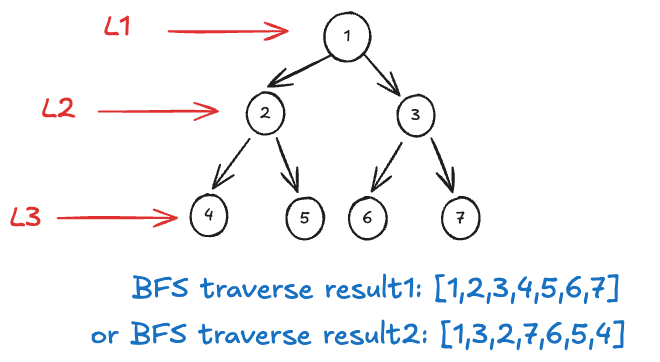
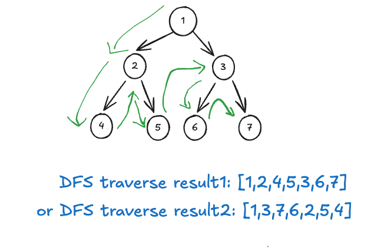

# Leetcode Practice w8
## 前言
本週是 Leetcode Weekly Practice 的第八週, 總共三題, 其中２ 題 Easy , 一題 Medium, 上週 Blind 75 的 Linked List 題目已經完成, 這週來分享延伸的另一個題型 **Tree**。再分享三題之前要先來說明訪問 Tree 的兩種不同的方法, **BFS & DFS**, 順便複習大學所學的基本知識 (都忘得差不多了 😅)。

### BFS
BFS, 為 Breadth First Search 的縮寫, 中文譯為*廣度優先搜尋*, 其概念為一層一層式的擴展走訪節點, 可以看作”同時“ 走訪某一個節點的所有節點, 再依序下去, 層層遞進。通常會使用 **Queue** 這個資料結構來實作, 藉由 **FIFO (First In First Out) 的特性**來完成 bfs 層層式的走訪。來看以下示例圖：




以下為 BFS 走訪 binary tree 的參考 script: 
```JS
function bfs(node) {
	const result = [];
	if (!node) return result;
	const queue = [node];

	while (queue.length > 0) {
		let n = queue.shift();
		result.push(n.val);

		if (n.left) queue.push(n.left);
		if (n.right) queue.push(n.right);
	}
	return result;
}
```
> 註: JavaScript 並沒有內建 Queue 資料結構, 需要借助第三方 library, 或自行實作, 上面例子用 list 代替 queue, 概念上相同, 但 Time Complexity 不同。
### DFS
DFS, 為 Depth First Search 的縮寫, 中文譯為*深度優先收尋*, 其概念為持續走訪某一節點的子節點直到無法再訪問, 接者才回到原節點的另一個子節點去走訪。通常會使用 **Stack** 這個資料結構來實作, 藉由 **FILO (First In Last Out) 的特性**來完成 dfs 向下專研式的走訪。來看以下示例圖：



以下為 DFS 走訪的 binary tree 的參考 script:

```JS
function dfs(node) {
	const result = [];
	if (!node) return result;
	const stack = [node];

	while (stack.length > 0) {
		let n = stack.pop();
		result.push(n.val);

		//Note: 因為 stack 的特性, 所以加入的時候順序要反過來
		if (n.right) stack.push(n.right);
		if (n.left) stack.push(n.left);
	}
	return result;
}
```
> 註: JavaScript 並沒有內建 Stack 資料結構, 需要借助第三方 library, 或自行實作, 上面例子用 list 代替 stack, 概念上相同, 但 Time Complexity 不同。

關於 DFS 的實作也可以使用 recursive call 來完成, 這邊就不再提供 script, 稍後的題目中會有範例可參考。那在對以上兩種不同走訪 tree 的方式有基礎的認識後, 我們來介紹要分享的 Leetcode 題目。

在進入題目介紹前還是要再次強調, 以下的參考都是使用 JS list 來代替 queue & stack, 操作的概念上相同但是時間複雜度不同, 需要特別注意。

## 題目

### 1 -  Invert Binary Tree
Leetcode [第 226 題](https://leetcode.com/problems/invert-binary-tree/), 以下為原文：
```
Given the root of a binary tree, invert the tree, and return its root.

Example 1:
Input: root = [4,2,7,1,3,6,9]
Output: [4,7,2,9,6,3,1]

Example 2:
Input: root = [2,1,3]
Output: [2,3,1]

Example 3:
Input: root = []
Output: []
 
Constraints:
The number of nodes in the tree is in the range [0, 100].
-100 <= Node.val <= 100
```

> ex1 graph


> ex2 graph

題目要求：
*input 一個 binary tree 的 head node, 將整個 binary tree 做 invert (head node 之下所有 left node & right node 互相交換)並返回*

觀察上面 example 示例圖, 可以發現,除了 root 以外, tree 中所有 sub left node 皆與同 parent node 的 sub right node 互換位置。那這邊有趣的來了, 既然都要交換, 那我們可以選擇從上到下 (Top Down) 或是從下到上 （Bottom Up）兩種不同的方式一一將所有的 left node & right node 交換。

以下為 Top Down 的參考解：
```JS
//NOTE: Top Down. recursive
function invertTree(root){
	if(!root)
		return null;
	const temp = root.left;
	root.left = root.right;
	root.right = temp;

	invertTree(root.left);
	invertTree(root.right);

	return root;
}
```


其實 top down 的概念與 BFS 走訪類似, 我們可以藉由 queue 資料結構一層層的反轉 left & right node, 直到全部翻轉完畢。以下為另一種 Top Down 的參考解：

```JS
//NOTE: BFS, iterative
function invertTree(root){
	if(!root)
		return null;
	const queue = [root];

	while(queue.length > 0){
		let node = queue.shift();
		let temp = node.left;
		node.left = node.right;
		node.right = temp;

		if(node.left)
			queue.push(node.left);
		if(node.right)
			queue.push(node.right);
	}
	return root;
}
```


我們再來看看 Bottom Up 參考解：

```JS
//NOTE: Bottom Up, recursive
function invertTree(root){
	if(!root)
		return null;
	root.left = invertTree(root.left);
	root.right = invertTree(root.right);

	const temp = root.left;
	root.left = root.right;
	root.right = temp;

	return root;
}
```

從上面兩個參考解可以看到, 我們僅僅只是調換 recursive & 交換左右 node 的順序, 就能造就反轉開始的位置截然不同。

既然能夠用 BFS 走訪 binary tree, 那其實此題也可以使用 DFS 走訪來解, 能使用 iterative 或 recursive 來達成, 來看以下參考解：

```JS
//NOTE: DFS, recursive
function invertTree(root){
	if(!root)
		return null;
	const temp = root.left;
	root.left = invertTree(root.right);
	root.right = invertTree(temp);

	return root;
}
```

```JS
//NOTE: DFS, iterative
function invertTree(root){
	if(!root)
		return null;
	const stack = [root];
	while(stack.length > 0){
		const node = stack.pop();
		const temp = node.left;
		node.left = node.right;
		node.right = temp;
	
		if(node.left)
			stack.push(node.left)
		if(node.right)
			stack.push(node.right)
	}

	return root;
}
```

此題無論使用哪一種解法, 平均 Time Complexity 皆為 O(n) （因為走訪每一個 node）, Space Complexity 則為 O(n) （Worst Case O(n)）。

### 2 - Maximum Depth of Binary Tree
Leetcode [第 104 題](https://leetcode.com/problems/maximum-depth-of-binary-tree/), 以下為原文：
```
Given the root of a binary tree, return its maximum depth.
A binary tree's maximum depth is the number of nodes along the longest path from the root node down to the farthest leaf node.

Example 1:
Input: root = [3,9,20,null,null,15,7]
Output: 3

Example 2:
Input: root = [1,null,2]
Output: 2
 
Constraints:
The number of nodes in the tree is in the range [0, 104].
-100 <= Node.val <= 100
```

> ex1 graph

題目要求：
*input 一個 binary tree 的 head node, 定義 tree 的 depth, 其中 head node 為 1, head 的 left & right 為 2, 依此推類 ,求這個 binary tree 的 maximum depth*

此題一樣可以選擇使用 Top Down or Bottom Up 的方式找出解答, 先來看 bottom up 的參考解：

```JS
//NOTE: Bottom Up, recursive
function maximumDepth(root){
	if(!root)
		return 0;
	if(!root.left && !root.right)
		return 1;
	return Math.max(maximumDepth(root.left) + 1, maximumDepth(root.right) +1);
}
```

此題的概念不難, 使用遞迴的方式從最小單位開始往上構建解答, 這個過程就跟 Bottom Up 相呼應。那麼此題遞迴的最小單位為何？就是 "leaf node", 也就是沒有 left & right 的 node (tree 最底部的 node)。

接著遞迴的關鍵將大問題轉換成較小的子問題, 以 `maximumDepth( )` 這個 function 來說 其 return 值為當前 tree 的 maximumDepth, 而這個 maximumDepth 我們可以將其轉換為 **1+ Max(左子樹 maximumDepth, 右子樹 maximumDepth)**。想通了這點之後, 此題的解法就是這麼簡單明瞭 XD。

> 註： root = null return 0 的 edge case handling 必須要加上, 因為題目不保證任意 node 皆有或皆無 left & right, 有可能只有一個。

我們再來看看 Top Down 的參考解：

```JS
//Top Down, BFS, iterative
function maxiumumDepth(root){
	if(!root)
		return 0;
	const queue = [root];
	let level = 0;
	while(queue.length > 0){
		const size = queue.length;
		//將下一層 level 的所有 node 都加入到 queue 中
		for(let i=0; i<size; i++){
			const node = queue.shift();
			if(node.left)
				queue.push(node.left);
			if(node.right)
				queue.push(node.right);
		}
		level++;
	}
	return level;
}
```

此題 Top Down 就使用 BFS 的方式走訪 tree,  我們將同一 level 的走訪視一個 iteration, 而從 queue 中 shift 的動作視為走訪完畢。在走訪各個 node 的過程中會連帶將其 left & right 加入到 queue 中, 等到同 level 所有的 node 都已經 shift (走訪過後) 後, 下一輪也就是下一層 level 的走訪持續進行, 最終直至結束。當結束時, level 的值即為 maximumDepth。

### 3 - Binary Tree Level Order Traversal
Leetcode [第 102 題](https://leetcode.com/problems/binary-tree-level-order-traversal/), 以下為原文：
```
Given the root of a binary tree, return the level order traversal of its nodes' values. (i.e., from left to right, level by level).

Example 1:
Input: root = [3,9,20,null,null,15,7]
Output: [[3],[9,20],[15,7]]

Example 2:
Input: root = [1]
Output: [[1]]

Example 3:
Input: root = []
Output: []
 
Constraints:
The number of nodes in the tree is in the range [0, 2000].
-1000 <= Node.val <= 1000
```

> ex1 graph

題目要求：
*input 一個 binary tree 的 head node, 將 tree 的 node value 以 level order 的方式返回 (nested list, 相同 level 在同一 list 中)*

Level Order ! 這題非常單純, 其實就是在考驗是否熟悉用 queue 實作 BFS 的方法, 因為 bfs 其實就是 level order traversal  😆, 來看以下參考解：

```JS
function levelOrderTraversal(root){
	if(!root) return [];
	const result = [];
	const queue = [root];
	while(queue.length > 0){
		const size = queue.length;
		const temp = [];
		for(let i=0; i<size; i++){
			const node = queue.shift();
			temp.push(node.val);

			if(node.left)
				queue.push(node.left);
			if(node.right)
				queue.push(node.right);
		}
		result.push(temp);
	}
	return result;
}
```
是不是非常熟悉的感覺？ 沒錯, 其實前一題 Top Down (BFS) 解法就是利用 level 的概念, 而這邊也是一樣, 只不過換成處理每一個 level 為一個 sub list 罷了, 兩者本質上都是 level order。

另外, 此題也可以用 Recursive 的方式解, 類似前一題計算 maxDepth 時的操作, 有點 tricky, 但是也算好理解, 來看參考解：

```JS
let levelOrder = function (root) {
	result = []; //reset
	levelOrderWithDis(root, 0);
	return result;
};

let levelOrderWithDis = function (root, dis) {
	if (!root) return;
	if (!result[dis]) result[dis] = [];
	result[dis].push(root.val);
	levelOrderWithDis(root.left, dis + 1);
	levelOrderWithDis(root.right, dis + 1);

	return;
};
```
將 dis 做為參數傳遞下去, 順便當作 node 在第幾個 level 的對照。

以上的參考解平均 Time Complexity 為 O(n), Space Complexity 也為 O(n)。

## 結語
本週的 Leetcode 挑戰分享此三題真不錯, 雖說題目本身不會不好理解, 但是不同的解法涉及觀念各有不同。能夠再次撿起像是 BFS, DFS, Top Down, Bottom Up 等非常基本, 但已經還給老師的觀念, 個人覺得還是非常的不錯的 😂。 

不知不覺挑戰已經到了第八週, [2024 年尾的 6 個月個人 & 職涯目標](../2024_6_month_goal.md)  文中分享的其他目標基本上都做的馬馬虎虎, 不敢說百分百完成, 但唯獨 **Leetcode 練習 ＆ 持續輸出**這兩個目標有滿足前段時間訂的最低標準。因為不想將這好不容易建立起來的習慣給打破, 所以即便懶得寫題目與寫 blog 文, 但每週還是默默的坐到書桌前開始敲鍵盤 XD。 希望這個習慣持續保持下去, 只要做到平日的工作再怎麼忙都不會影響到這些行動時, 那便成功了。

總之本週的分享就到, 本篇為 2024 年的最後一篇文, 下一篇文下週 （明年）見, 繼續努力～